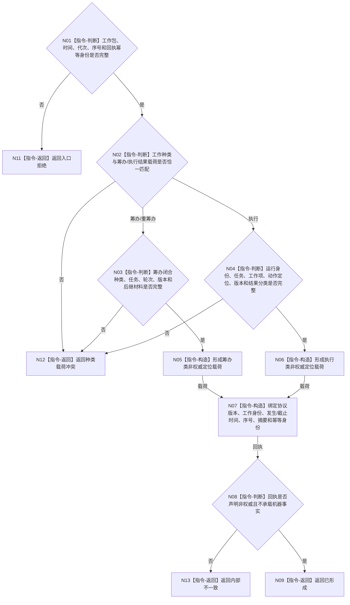

# BIZ-L3-004-07-06 形成任务工作结果回执目标函数流程图 v0.1

更新时间：2026-08-03

## 依据

```text
0050、5090、5230、8100；BIZ-L2-004-07、BIZ-L2-004-08
```

## 身份与边界

正式目标函数设计图。把筹办闭合结果或执行动作定位材料规范化为恰一种非权威不可变回执；不读取或写入业务事实。

## 函数合同

```text
根函数：形成任务工作结果回执
归属模块 / 文件 / 层级：任务工作结果协议 / 海中鱼巣/线程/任务工作结果协议.ixx / L3
现有或待新增：适配扩展；复用任务结果回执协议并增加统一筹办/重筹办/执行载荷
完整签名：任务工作结果回执形成结果 形成任务工作结果回执(const 任务工作结果回执形成请求& 请求)
参数：请求为只读借用；含原不可变工作包、筹办闭合结果或执行动作定位材料恰一项、发生时间、截止时间、运行代次、来源任务序号和回执幂等身份
返回结果：调用方拥有的不可变值式结果；含已形成、入口拒绝、种类载荷冲突、版本漂移或内部不一致，以及强类型任务工作结果回执
被调函数流程图：无；字段复核、摘要和构造均为本函数内指令
父图：BIZ-L2-004-07；BIZ-L2-004-08消费
```

## 流程图



## 节点合同

| 节点 | 类型 | 输入 | 输出 | 事实读写 | 验证 |
| --- | --- | --- | --- | --- | --- |
| N02—N04 | 指令-判断 | 种类和互斥结果 | 合法载荷分支 | 无 | 不按空字段猜种类 |
| N05—N07 | 指令-构造 | 工作包与结果 | 不可变回执 | 无 | 完整来源、稳定幂等、摘要可复核 |
| N08/N09 | 判断 / 返回 | 回执 | 已形成结果 | 无 | 强制非权威标记 |

## 关键边界

回执只承载定位、防重和过程分类。筹办回执不成为持久化筹办事实；执行回执不携带目标满足、任务完成、需求满足或服务结算结论。

