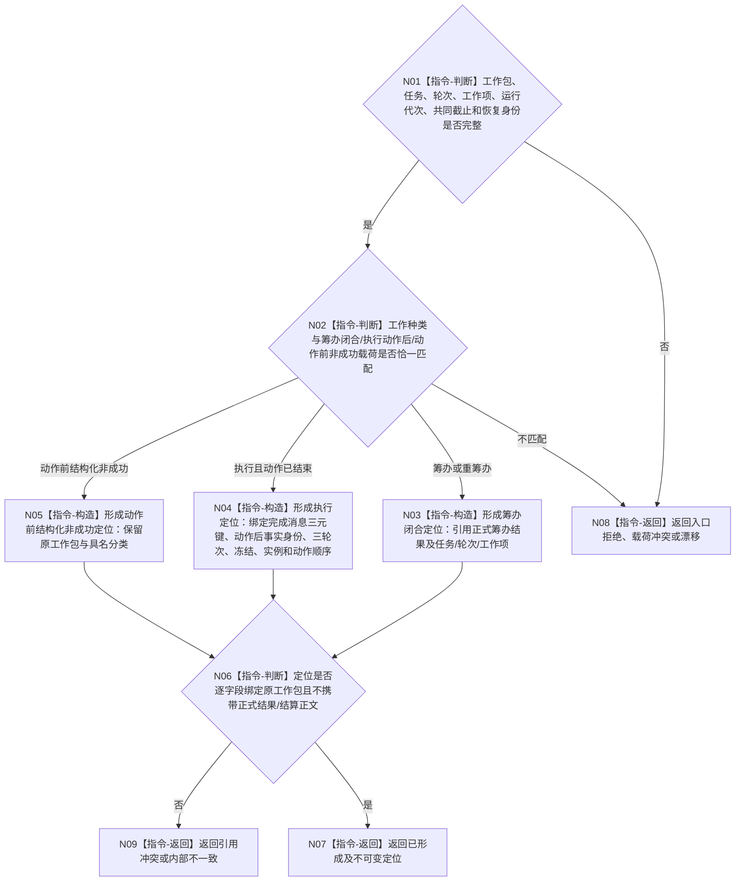

# BIZ-L3-004-07-06 形成任务工作结果定位目标函数流程图 v0.2

更新时间：2026-08-27

## 依据与替代

```text
0050、5090、5230、8100；BIZ-L2-004-07 v0.2、BIZ-L2-004-08 v0.3
```

本图替代旧“形成任务工作结果回执”v0.1。结果定位是T04向T03交付的不可变读回键，不是正式任务结果、结算结论或机器事实正文。

## 函数合同

```text
根函数：形成任务工作结果定位
归属模块 / 文件 / 目标分解深度：任务工作结果定位协议 / 海中鱼巣/线程/任务工作结果定位协议.ixx / BIZ-L3
现有或待新增：待新增；发布源码只有旧任务结果回执协议
完整签名：任务工作结果定位形成结果 形成任务工作结果定位(const 任务工作结果定位形成请求& 请求) noexcept
参数：原不可变工作包、筹办闭合材料或执行动作后定位材料恰一项、运行代次、发生时间、共同截止、工作项和恢复幂等身份
返回结果：已形成、入口拒绝、种类载荷冲突、版本/当前性漂移、引用冲突、资源失败或内部不一致；成功携带不可变任务工作结果定位
被调函数流程图：无；只做值式逐字段验证和构造
父图：BIZ-L2-004-07 v0.2；BIZ-L2-004-08 v0.3消费
```

## 流程图



## 关键边界

- 筹办定位引用已发布筹办闭合事实；不建立独立持久化筹办回执。
- 执行定位必须保留执行幂等身份、运行代次和最后动作顺序，使T03能按三元键独立读取完成消息并继续权威读回。
- 定位可以表达动作前普通拒绝、等待、漂移或材料不足，但不能声明正式任务结果、任务轮次收束、需求满足或self后继决议。
- 形成失败不得用旧回执、线程计数、日志或空成功替代。
