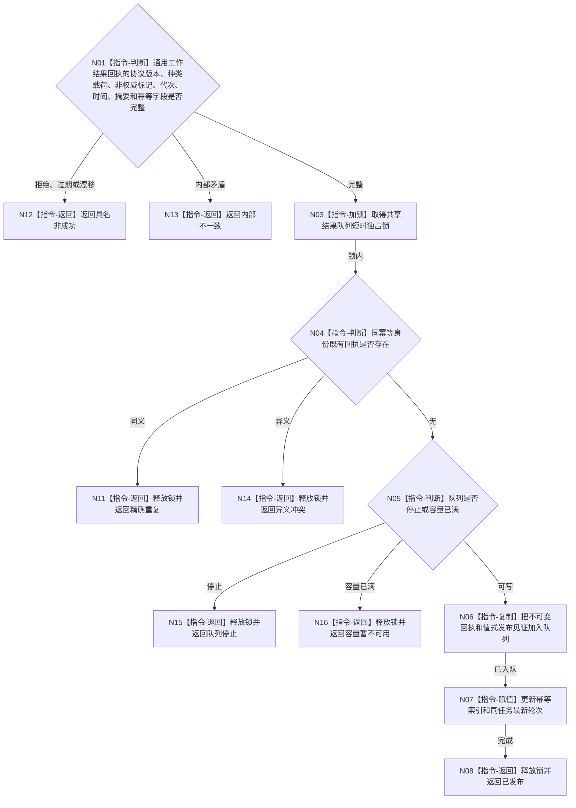

# BIZ-L3-004-07-07 发布或重试强类型任务工作结果回执目标函数流程图 v0.1

更新时间：2026-08-03

## 依据

```text
0050、5090、8100；BIZ-L2-004-07、BIZ-L2-004-08
```

## 身份与边界

正式目标函数设计图。把同一不可变任务工作结果回执发布到共享有界结果队列，或在短时不可用后只重试同一回执；不重复筹办、方法动作或事实提交。

## 函数合同

```text
根函数：任务工作结果队列::发布或重试强类型任务工作结果回执
归属模块 / 文件 / 层级：任务工作结果队列 / 海中鱼巣/线程/任务工作结果队列.ixx / L3
现有或待新增：适配扩展；从具体任务工作线程私有回执队列分离为线程池共享结果队列
完整签名：任务工作结果发布结果 任务工作结果队列::发布或重试强类型任务工作结果回执(const 任务工作结果发布请求& 请求)
参数：请求为只读借用；含不可变回执、当前时间、运行代次及可选同幂等键既有回执；重试必须逐字段等于首次回执
返回结果：调用方拥有的值式结果；含已发布、精确重复、容量暂不可用、队列停止、已过期、异义冲突或内部不一致，以及原回执和值式发布见证
被调函数流程图：无；通用工作结果回执字段复核和队列操作均为本函数内指令
父图：BIZ-L2-004-07；BIZ-L2-004-08消费
```

## 流程图



## 节点合同

| 节点 | 类型 | 输入 | 输出 | 事实读写 | 验证 |
| --- | --- | --- | --- | --- | --- |
| N01 | 指令-判断 | 通用工作结果回执、代次和时间 | 协议资格 | 无业务写入 | 全工作种类、过期、防重 |
| N03—N07 | 锁 / 判断 / 复制 | 合法不可变回执 | 共享队列项 | 只写非权威队列 | 满载不覆盖、同键异义拒绝 |
| N08/N11—N16 | 返回 | 队列状态 | 结构化发布结果 | 无业务写入 | 停止、暂满、重复分离 |

## 关键边界

容量暂不可用后，调用方必须保留并重试逐字段相同的回执。禁止重新执行筹办、真实动作或事实提交来生成“新回执”；队列发布成功也不证明业务结果成立。
