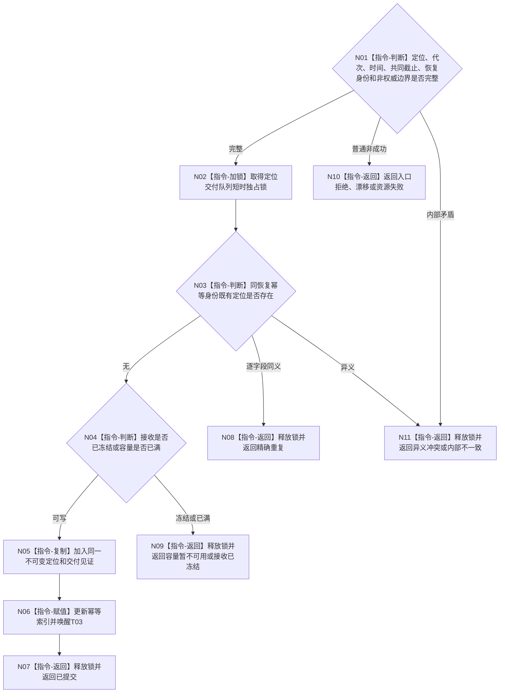

# BIZ-L3-004-07-07 提交或重试任务工作结果定位目标函数流程图 v0.2

更新时间：2026-08-27

## 依据与替代

```text
0050、5090、8100；BIZ-L2-004-07 v0.2、BIZ-L2-004-08 v0.3、BIZ-L2-004-09 v0.4
```

本图替代旧“发布或重试强类型任务工作结果回执”v0.1。目标队列只承载不可变任务工作结果定位；T03取出后必须独立读回，队列项不成为正式结果。

## 函数合同

```text
根函数：任务工作结果定位交付端::提交或重试任务工作结果定位
归属模块 / 文件 / 目标分解深度：任务工作结果定位交付端 / 海中鱼巣/线程/任务工作结果定位交付端.ixx / BIZ-L3
现有或待新增：待新增；HEAD只有T04到T03旧回执直接调用
完整签名：任务工作结果定位提交结果 任务工作结果定位交付端::提交或重试任务工作结果定位(const 任务工作结果定位提交请求& 请求) noexcept
参数：不可变定位、运行代次、当前时间和恢复幂等身份；重试必须逐字段等于首次定位
返回结果：已提交、精确重复、容量暂不可用、接收已冻结、版本/当前性漂移、异义冲突、资源失败或内部不一致，以及原定位和值式交付见证
被调函数流程图：无；字段复核、幂等检查和有界队列操作均为本函数内指令
父图：BIZ-L2-004-07 v0.2；BIZ-L2-004-09 v0.4取出并交BIZ-L2-004-08 v0.3消费
```

## 流程图



## 关键边界

- 容量暂不可用或资源失败后只能重试同一定位；不得重做筹办、方法动作、完成消息或事实发布。
- 接收冻结不授权丢弃已经形成的定位。调用方必须保留唯一在途槽，直到T03接管、精确重复或专属恢复owner取得可读见证。
- 提交成功只证明定位进入T03输入边界，不证明正式任务结果已发布、轮次已收束或需求已满足。
- 同键异义是冲突，不得覆盖旧定位或换键伪装首次提交。
