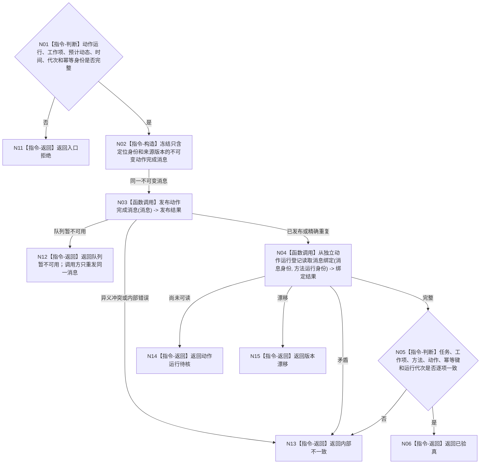

# BIZ-L3-004-07-08 发布并验真动作完成消息目标函数流程图 v0.1

更新时间：2026-08-04

## 依据

```text
0050、4220、5090、8100、8210；BIZ-L2-004-07；确认稿第22、38项
```

## 身份与边界

正式目标函数设计图。根函数发布一条只用于定位动作运行的不可变完成消息，并通过与动作执行路由分离的读取路径核对消息身份和动作绑定；不读取或写入目标实际状态，不发布正式动态。

## 函数合同

```text
根函数：动作完成消息桥::发布并验真动作完成消息
归属模块 / 文件 / 层级：动作完成消息桥 / 海中鱼巣/线程/动作完成消息桥.ixx / L3
现有或待新增：待新增；不得复用任务工作结果回执代替动作完成消息
完整签名：动作完成消息验真结果 动作完成消息桥::发布并验真动作完成消息(const 动作完成消息请求& 请求)
参数：请求为只读借用；含任务、工作项、方法运行、动作入口、动作幂等键、预计动作动态、开始/结束时间、运行代次、消息幂等身份和来源版本
返回结果：调用方拥有的不可变值式结果；含已验真、精确重复、队列暂不可用、动作运行待核、版本漂移、入口拒绝或内部不一致，以及完成消息身份、动作运行绑定和验真版本
被调函数流程图：动作完成消息队列发布与独立动作运行登记读取若隐藏非平凡组合，实施设计时继续展开
父图：BIZ-L2-004-07
```

## 流程图



## 节点合同

| 节点 | 类型 | 输入 | 输出 | 事实读写 | 验证 |
| --- | --- | --- | --- | --- | --- |
| N02/N03 | 构造 / 函数调用 | 动作运行结果 | 不可变完成消息与发布结果 | 只写消息边界 | 重试同一消息不重做动作 |
| N04/N05 | 函数调用 / 判断 | 消息与动作运行稳定身份 | 独立绑定验真 | 只读动作运行登记 | 不使用发送方自报或日志验真 |
| N06/N11—N15 | 返回 | 验真裁决 | 结构化结果 | 无业务事实写入 | 等待、漂移和内部错误分离 |

## 关键边界

预计动作动态随消息只作校准输入定位，不是正式动态。消息发布或验真成功均不证明目标状态已变化；只有后继从权威状态所有者重新读取并完成校准后，才能发布可证明的正式动态。
