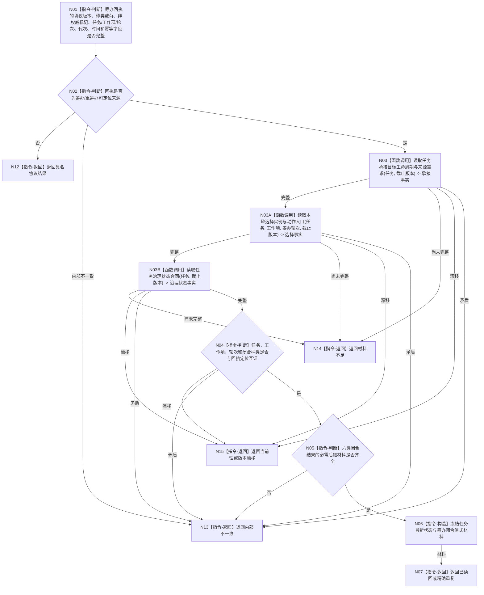

# BIZ-L3-004-08-01 独立读回筹办闭合结果与任务状态目标函数流程图 v0.1

更新时间：2026-08-03

## 依据

```text
0050、5090、5230、8100；BIZ-L2-004-08、BIZ-L2-004-03
```

## 身份与边界

正式目标函数设计图。以筹办回执定位任务和轮次，从任务服务重新读取已发布的筹办闭合结果；不重复筹办、不重新发布选择或冻结，也不相信回执自报结论。

## 函数合同

```text
根函数：运行期只读查询组合器::独立读回筹办闭合结果与任务状态
归属模块 / 文件 / 层级：运行期只读查询 / 海中鱼巣/领域/组合.运行期只读查询.ixx / L3
现有或待新增：待新增；复用任务服务的任务、筹办轮次、占用、选择和冻结读取
完整签名：筹办闭合独立读回结果 运行期只读查询组合器::独立读回筹办闭合结果与任务状态(const 筹办闭合独立读回请求& 请求) const
参数：请求为只读借用；含筹办/重筹办回执、任务、工作项、筹办轮次、运行代次、事实截止版本和当前时间
返回结果：调用方拥有的不可变值式结果；含已读回、精确重复、材料不足、当前性漂移、版本漂移或内部不一致，以及六类筹办闭合结果、任务最新生命周期、选择/冻结、等待/缺口/子目标材料和来源版本
被调函数流程图：复用BIZ-L4-004-05-02-01读取任务承接、目标、生命周期与来源需求，复用BIZ-L4-004-05-02-02读取本轮选择、实例与动作入口，复用BIZ-L4-004-11-01-03读取任务治理状态合同；通用筹办回执字段复核为本函数内指令
父图：BIZ-L2-004-08
```

## 流程图



## 节点合同

| 节点 | 类型 | 输入 | 输出 | 事实读写 | 验证 |
| --- | --- | --- | --- | --- | --- |
| N01/N02 | 指令-判断 | 筹办回执与当前代次 | 定位资格 | 无 | 回执非权威、种类准确 |
| N03/N03A/N03B/N04 | 调用 / 判断 | 任务、轮次和截止 | 已发布承接、选择和治理状态事实 | 只读任务服务 | 回执篡改、旧轮次、错工作项 |
| N05/N06 | 判断 / 构造 | 六类闭合结果 | 完整后继材料 | 无 | 无结构“无法解决”禁止 |

## 关键边界

`目标已完成` 只证明筹办闭合结果已经发布；任务管理线程仍须把该来源交给 `独立回读任务实际结果` 重新读取当前目标事实并比较，不能直接完成任务。
