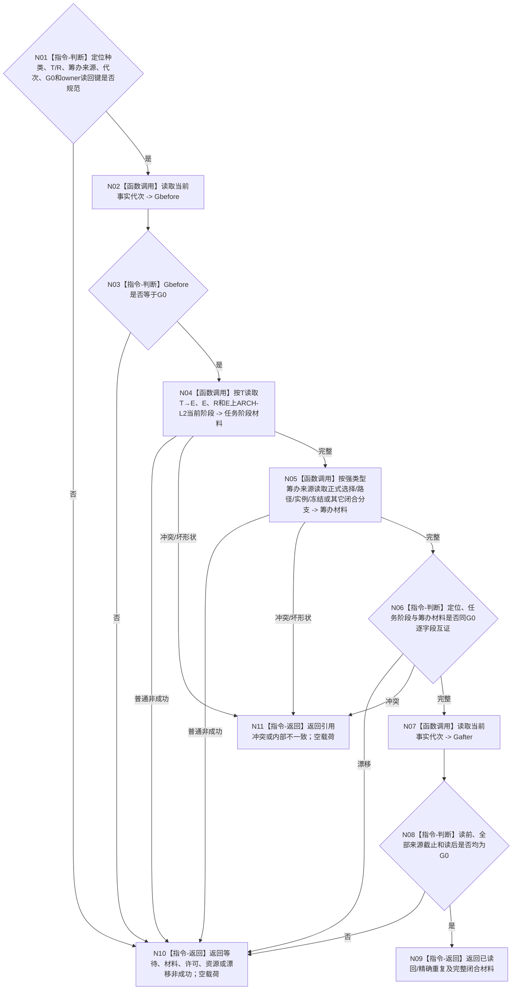

# BIZ-L3-004-08-01 独立读回筹办闭合结果与任务状态目标函数流程图 v0.2

更新时间：2026-08-28

## 依据与替代

```text
0050 v2.1、4230、4260 v0.9、5090 v0.7、5230 v1.2、8100 v0.7；BIZ-L2-004-08 v0.3、BIZ-L2-004-03 v0.2
```

本图替代 v0.1。旧图以“筹办回执”定位并读取旧任务治理状态；v0.2只消费T04形成的 `任务工作结果定位`，按其中强类型任务、轮次、筹办来源和owner读回身份重读正式筹办结果。当前阶段只来自任务专属E上的ARCH-L2当前状态选择，旧治理状态不参与裁决。

## 函数合同

```text
根函数：运行期只读查询组合器::独立读回筹办闭合结果与任务状态
归属模块 / 文件 / 目标分解深度：运行期只读查询 / 海中鱼巣/领域/组合.运行期只读查询.ixx / BIZ-L3
现有或待新增：待新增目标组合
完整签名：筹办闭合独立读回结果 运行期只读查询组合器::独立读回筹办闭合结果与任务状态(const 筹办闭合独立读回请求& 请求) const noexcept
参数：筹办类任务工作结果定位、T/R、强类型筹办来源、运行代次、非零G0和读取规则版本
返回结果：已读回、精确重复、合法等待、材料不足、当前性/版本漂移、许可/资源失败、引用冲突或内部不一致；成功载荷含正式选择/路径/实例/冻结或其它闭合分支材料及E上当前阶段
被调函数流程图：task owner按筹办来源读取正式选择/路径/实例/冻结；任务/存在/阶段owner读取T→E、E、R和ARCH-L2当前阶段；其它闭合分支读取各自正式owner
父图：BIZ-L2-004-08 v0.3
```

## 流程图



## 关键边界

- 工作结果定位只提供正式读回键，不能携带或决定筹办闭合正文。
- 筹办目标已满足也只是一项正式筹办分支，不直接写需求满足、任务实际结果、轮次结算或self消息。
- 旧任务治理存在/状态与ARCH-L2当前阶段冲突时，必须返回旧值漂移并服从ARCH-L2；禁止回退旧权威。
