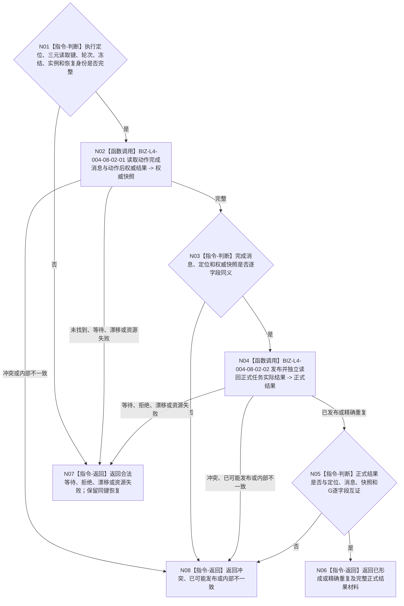

# BIZ-L3-004-08-02 独立读回动作后权威结果并发布正式任务结果目标函数流程图 v0.1

更新时间：2026-08-26

## 依据

```text
0050 v1.9、4260 v0.9、5090 v0.7、5230 v1.2、8100 v0.7
BIZ-L2-004-08 v0.3；BIZ-L2-004-07 v0.2
HEAD 4f96a027：任务管理线程::处理一个工作定位、任务动作权威结果读回提供者、任务实际结果上行桥
```

## 身份与边界

正式目标函数设计图。函数从执行定位的三元键读取不可变动作完成消息，逐字段互证任务、轮次、冻结、实例、动作顺序和运行代次，再独立读取动作后权威状态/动态快照，最后由 task owner 发布并独立读回正式任务实际结果。完成消息、方法返回和工作定位都不是正式结果。

本函数不比较需求目标，不迁移任务生命周期，不收束任务轮次，不形成 self 消息。

## 函数合同

```text
根函数：任务实际结果上行桥::发布并独立读回正式任务结果
归属模块 / 文件 / 目标分解深度：任务实际结果上行桥 / 海中鱼巣/线程/上行桥.任务实际结果.ixx / BIZ-L3
现有或待新增：适配现有 `发布并形成治理消息_v2`；应退出误导性“治理消息”命名
完整签名：任务正式结果形成结果 任务实际结果上行桥::发布并独立读回正式任务结果(const 任务工作结果定位& 定位) noexcept
参数：完整执行定位；含执行幂等身份、运行代次和最后动作顺序
返回结果：已形成、精确重复、合法等待、入口/许可拒绝、当前性漂移、引用/幂等冲突、资源失败、已可能发布或内部不一致；成功携带完成消息、权威快照、实例方法、正式任务结果和读回截止
被调函数流程图：BIZ-L4-004-08-02-01、BIZ-L4-004-08-02-02
父图：BIZ-L2-004-08 v0.3
```

## 流程图



## 关键边界

- 消息运行代次必须等于定位运行代次；错误代次读取未找到，禁止跨代次回退。
- 动作后状态已经改变但归因不足时保留真实状态并返回具名非成功，不补造正式任务结果。
- 正式结果发布后读回失败只按同幂等身份和提交见证恢复，不重新执行动作。
- HEAD已具备相邻链，但上行桥仍读取来源需求组并保留旧参数；该旧读取不得被解释为结果分配或轮次收束前置。
