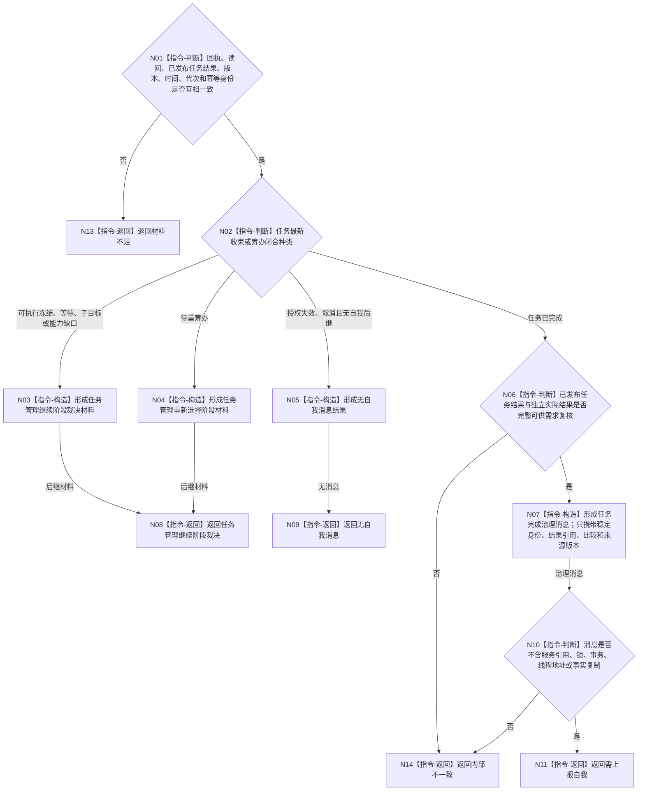

# BIZ-L3-004-08-02 转换任务结果治理消息目标函数流程图 v0.1

更新时间：2026-08-03

## 依据

```text
0050、5090、5160、8100；BIZ-L2-004-08、BIZ-L2-004-14
```

## 身份与边界

正式目标函数设计图。把已发布任务收束结果和独立实际结果规范化为任务管理内部后继材料，或形成交给自我线程的非权威治理消息；不复制任务事实，不提交需求结算。

## 函数合同

```text
根函数：任务结果治理消息形成器::转换任务结果治理消息
归属模块 / 文件 / 层级：任务结果治理消息算法 / 海中鱼巣/线程/任务结果治理消息.ixx / L3
现有或待新增：适配扩展；复用现行上行桥治理消息转换并增加任务已发布结果和筹办分支
完整签名：任务结果治理消息形成结果 任务结果治理消息形成器::转换任务结果治理消息(const 任务结果治理消息形成请求& 请求) const
参数：请求为只读借用；含原工作回执、可选筹办读回、独立实际结果、已发布任务收束结果、任务最新版本、运行代次、发生时间和消息幂等身份
返回结果：调用方拥有的不可变值式结果；含任务管理继续阶段裁决、无自我消息、需上报自我、材料不足或内部不一致，以及可选后继裁决材料和自我治理消息
被调函数流程图：无；分支判断与值式消息构造均为本函数内指令
父图：BIZ-L2-004-08；消息由BIZ-L2-004-14提交
```

## 流程图



## 节点合同

| 节点 | 类型 | 输入 | 输出 | 事实读写 | 验证 |
| --- | --- | --- | --- | --- | --- |
| N01/N02 | 指令-判断 | 回执与发布后任务 | 后继分类 | 无 | 消息顺序不替代任务状态 |
| N03—N05 | 指令-构造 | 非完成分支 | 任务管理内部后继 | 无业务写入 | 不向自我泄漏纯线程状态 |
| N06/N07 | 判断 / 构造 | 已完成任务与独立结果 | 自我治理消息 | 无 | 需求结算所需证据只作引用 |
| N10/N11 | 判断 / 返回 | 值式消息 | 上报结果 | 无 | 不携带可变服务或事实副本 |

## 关键边界

只有任务领域已经发布“已完成”后，才向自我线程发送需求复核材料。待重筹办、可执行冻结和普通等待由任务管理线程继续裁决，不因回执到达直接变成自我需求事实。

