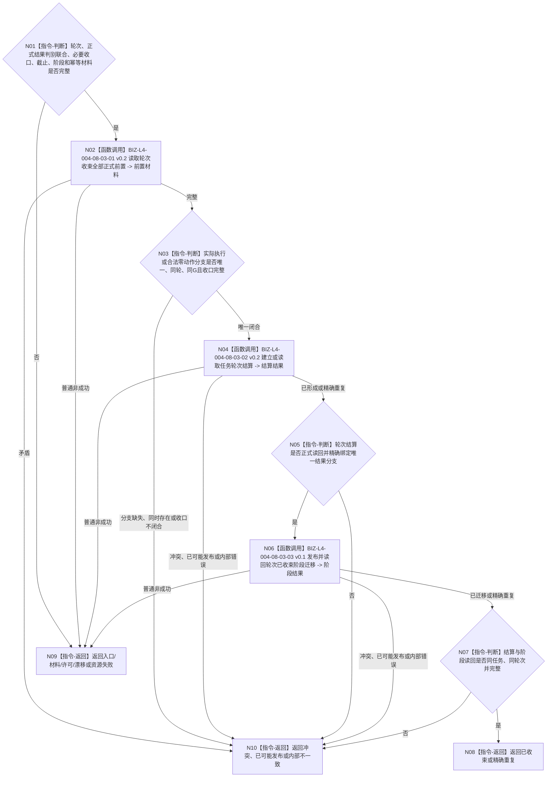

# BIZ-L3-004-08-03 收束当前任务轮次目标函数流程图 v0.2

更新时间：2026-08-27

## 依据与替代

```text
0050、3200、4260 v0.9、5090 v0.7、5210 v1.1、8100 v0.7
父图：BIZ-L2-004-08 v0.2、BIZ-L2-004-17 v0.1
```

本图完整替代 v0.1。v0.1只允许正式任务实际结果进入轮次收束，不能承载5210已经允许的合法无执行短路结果；v0.2以强类型判别联合接收二者恰一，并保持同一轮次结算、阶段迁移和读回路径。

## 身份与边界

正式目标函数设计图。函数只以本轮“正式任务实际结果 / 合法无执行短路结果”恰一分支、验证与归因适用性收口、执行冻结与授权收口、运行停止证据和当前阶段材料建立或精确重放任务轮次结算，并把任务阶段迁移为轮次已收束。它不等待全部 `T→D` 成员核算，不建立结果分配，不决定下一轮。

零动作分支不是方法执行：不得补造完成消息、动作顺序、实例执行结果或现实动态。执行分支也不得退化为短路结果。

## 函数合同

```text
根函数：任务轮次收束提供者::收束当前任务轮次
归属模块 / 文件 / 目标分解深度：任务轮次收束 / 海中鱼巣/领域/内部治理/服务.任务结果消费分配与轮次结算.ixx（名称待退出） / BIZ-L3
现有或待新增：迁移现有轮次收束provider；扩为正式结果判别联合并删除消费分配与全部T→D核算前置
完整签名：任务轮次收束结果 任务轮次收束提供者::收束当前任务轮次(const 任务轮次收束请求& 请求) noexcept
参数：任务、当前任务轮次、正式任务实际结果或合法无执行短路结果恰一、结果分支对应收口、共同来源截止、阶段迁移幂等和规则版本
返回结果：已收束、精确重复、入口/许可拒绝、材料不足、当前性/版本漂移、引用/幂等冲突、资源失败、已可能发布或内部不一致；成功携带轮次结算、阶段迁移证据和共同正式读回截止
被调函数流程图：BIZ-L4-004-08-03-01/02 v0.2、BIZ-L4-004-08-03-03 v0.1
```

## 流程图



## 分支矩阵

| 唯一结果分支 | 必须证明 | 禁止补造 |
| --- | --- | --- |
| 正式任务实际结果 | 完成消息验真、权威动作后结果、结果/验证/归因及执行收口均同轮同G | 合法无执行短路结果 |
| 合法无执行短路结果 | 筹办期目标fresh已满足、正式未执行证明、零方法/零动作/零动态及适用性收口均同轮同G | 完成消息、动作顺序、方法执行或现实动态 |

## 关键边界

- `0 / 1 / N` 条 `T→D` 均不阻塞轮次收束；需求只在自身使用时 fresh 核算。
- 两种结果分支共用轮次结算和阶段迁移，不建立第二轮次收束owner；同一轮次两种分支同时存在属于引用冲突。
- 当前工作区轮次结算 DTO / 服务仍含消费分配记录、需求核算组等旧字段，也没有合法无执行短路结果分支；迁移完成前本函数属于实现缺失。
