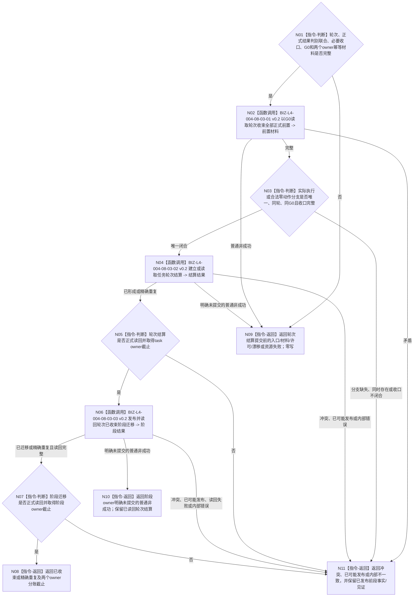

# BIZ-L3-004-08-03 收束当前任务轮次目标函数流程图 v0.3

更新时间：2026-08-27

## 依据与替代

```text
0050、3200、4260、5090、5210、8100
父图：BIZ-L2-004-08 v0.3、BIZ-L2-004-17 v0.3
被调图：BIZ-L4-004-08-03-01 v0.2、BIZ-L4-004-08-03-02 v0.2、BIZ-L4-004-08-03-03 v0.2
```

本图完整替代 v0.2。v0.2 已正确冻结“正式任务实际结果 / 合法无执行短路结果”恰一，但错误要求 task owner 的轮次结算和 ARCH-L2 阶段 owner 的迁移共享一个正式读回截止。v0.3 保留共同来源截止 `G0`，并把两个 owner 的相邻提交、正式读回截止、提交见证和后段失败边界完全分账。

## 身份与边界

正式目标函数设计图。函数只以本轮唯一正式结果分支、验证与归因适用性收口、执行冻结与授权收口、运行停止证据和当前阶段材料建立或精确重放任务轮次结算，再把任务阶段迁移为轮次已收束。它不等待全部 `T→D` 成员核算，不建立结果分配，不决定下一轮。

任务轮次结算由 task owner 发布；阶段当前选择与迁移动作由 ARCH-L2 阶段 owner 发布。前者成功后后者失败，不得回滚或隐藏已经发布的轮次结算。

## 函数合同

```text
根函数：任务轮次收束提供者::收束当前任务轮次
归属模块 / 文件 / 目标分解深度：任务轮次收束 / 海中鱼巣/领域/内部治理/服务.任务结果消费分配与轮次结算.ixx（名称待退出） / BIZ-L3
现有或待新增：迁移现有轮次收束provider；扩为正式结果判别联合并删除消费分配与全部T→D核算前置
完整签名：任务轮次收束结果 任务轮次收束提供者::收束当前任务轮次(const 任务轮次收束请求& 请求) noexcept
参数：任务、当前任务轮次、正式任务实际结果或合法无执行短路结果恰一、结果分支对应收口、共同来源截止G0、轮次结算幂等身份、阶段迁移幂等身份和规则版本
返回结果：已收束、精确重复、入口/许可拒绝、材料不足、当前性/版本漂移、引用/幂等冲突、资源失败、已可能发布或内部不一致；结构化结果分别承载轮次结算及其正式截止/见证、阶段迁移及其正式截止/见证
被调函数流程图：BIZ-L4-004-08-03-01/02 v0.2、BIZ-L4-004-08-03-03 v0.2
```

## 流程图



## owner 与截止分账

| 对象 | 写入 owner | 输入代次 | 成功截止 | 后继失败边界 |
| --- | --- | --- | --- | --- |
| 收束正式前置 | 各事实 owner 只读 | 共同来源 `G0` | `G0` | 不产生写入 |
| 任务轮次结算 | task owner | 紧邻该写入取得的 owner 当前代次 | `G任务结算` | 阶段迁移失败不撤销结算 |
| 轮次已收束阶段迁移 | ARCH-L2 阶段 owner | 紧邻该写入取得的 owner 当前代次 | `G阶段` | 读回失败保留迁移提交见证；不回滚结算 |

## 分支矩阵

| 唯一结果分支 | 必须证明 | 禁止补造 |
| --- | --- | --- |
| 正式任务实际结果 | 完成消息验真、权威动作后结果、结果/验证/归因及执行收口均同轮同 `G0` | 合法无执行短路结果 |
| 合法无执行短路结果 | 筹办期目标 fresh 已满足、正式未执行证明、零方法/零动作/零动态及适用性收口均同轮同 `G0` | 完成消息、动作顺序、方法执行或现实动态 |

## 关键边界

- `0 / 1 / N` 条 `T→D` 均不阻塞轮次收束；需求只在自身使用时 fresh 核算。
- 两种结果分支共用轮次结算和阶段迁移，不建立第二轮次收束 owner；同一轮次两种分支同时存在属于引用冲突。
- 结算已发布后，阶段迁移的拒绝、漂移、资源失败或已可能发布都必须返回结算正式引用及其截止；不得用“普通失败”暗示全程零写。
- 发布源码尚无本图轮次结算 DTO / 服务；当前工作区含旧消费分配字段的WIP不作为实现证据。本函数及合法无执行短路结果分支均属于实现缺失。
