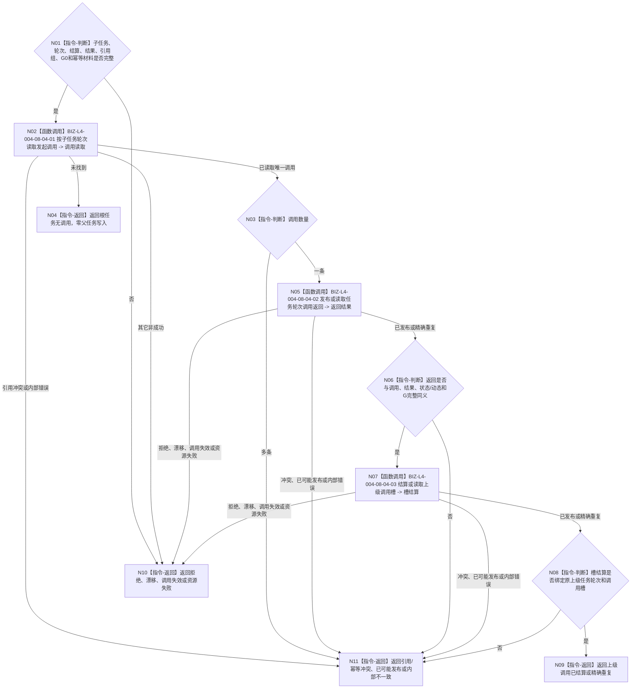

# BIZ-L3-004-08-04 返回并结算唯一上级调用槽目标函数流程图 v0.1

更新时间：2026-08-26

## 依据

```text
0050、4260 v0.11 第12.5—12.6节、5090 v0.8、5160 v0.5
BIZ-L2-004-08 v0.2、BIZ-L3-004-08-03
```

## 身份与边界

正式目标函数设计图。子任务轮次收束后，函数按该子任务轮次读取 0..1 条正式发起调用。零条按根任务收口；一条按结果验证合同发布或重放调用返回，并由 task owner 幂等结算唯一上级调用槽；多条为引用冲突。调用槽结算只表示结果已返回，不证明上级目标或需求满足。

## 函数合同

```text
根函数：任务调用返回提供者::返回并结算唯一上级调用槽
归属模块 / 文件 / 目标分解深度：任务调用返回 / 海中鱼巣/领域/内部治理/服务.任务调用返回.ixx / BIZ-L3
现有或待新增：待新增生产组合；4260 v0.11已冻结四个task owner公开入口
完整签名：任务调用返回结算结果 任务调用返回提供者::返回并结算唯一上级调用槽(const 任务调用返回结算请求& 请求) noexcept
参数：已收束子任务/轮次、轮次结算、正式结果、状态/动态引用组、G0、返回与槽结算幂等身份、时间和规则版本
返回结果：根任务无调用、上级调用已结算、精确重复、入口/许可拒绝、当前性漂移、调用失效、引用/幂等冲突、资源失败、已可能发布或内部不一致
被调函数流程图：BIZ-L4-004-08-04-01—03
父图：BIZ-L2-004-08 v0.2
```

## 流程图



## 关键边界

- 不得从需求树、`T→D`、同类任务锚点、线程队列或名称推导上级调用。
- 上级取消、换轮或槽失效后的迟到返回不改写当前上级任务。
- 返回或槽结算失败只重试同一幂等键，不重做子任务动作或轮次收束。
