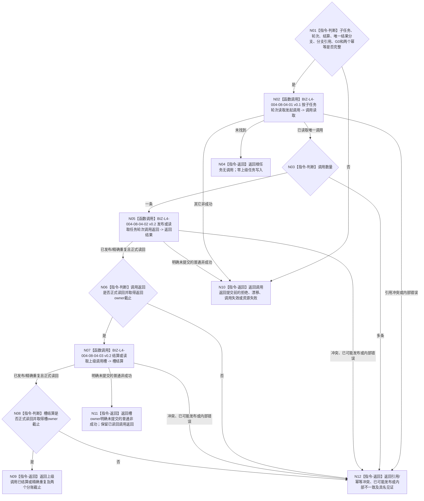

# BIZ-L3-004-08-04 返回并结算唯一上级调用槽目标函数流程图 v0.2

更新时间：2026-08-27

## 依据与替代

```text
0050、4260、5090、5160
BIZ-L2-004-08 v0.2、BIZ-L2-004-17 v0.2、BIZ-L3-004-08-03 v0.3
被调图：BIZ-L4-004-08-04-01 v0.1、BIZ-L4-004-08-04-02 v0.2、BIZ-L4-004-08-04-03 v0.2
```

本图完整替代 v0.1。v0.1 只接受“正式任务实际结果 + 状态 / 动态引用组”，与零动作收束调用本函数的路径冲突；v0.2 接受“正式任务实际结果 / 合法无执行短路结果”恰一判别联合，并把调用返回与上级调用槽结算两个相邻提交的截止和恢复见证分账。

## 身份与边界

正式目标函数设计图。子任务轮次收束后，函数只按该子任务轮次读取 `0..1` 条正式发起调用。零条按根任务收口；一条按调用冻结的结果验证合同发布或重放调用返回，再幂等结算唯一上级调用槽；多条为引用冲突。

调用返回只交付子任务本轮结果分支的强类型引用。正式实际结果分支携带其规范有序状态 / 动态引用；合法无执行短路分支显式要求状态 / 动态引用组为空。调用槽结算只表示结果已返回并唤醒上级任务 fresh 复核，不证明上级目标或需求满足。

## 函数合同

```text
根函数：任务调用返回提供者::返回并结算唯一上级调用槽
归属模块 / 文件 / 目标分解深度：任务调用返回 / 海中鱼巣/领域/内部治理/服务.任务调用返回.ixx / BIZ-L3
现有或待新增：待新增生产组合；task owner公开入口需按结果判别联合适配
完整签名：任务调用返回结算结果 任务调用返回提供者::返回并结算唯一上级调用槽(const 任务调用返回结算请求& 请求) noexcept
参数：已收束子任务/轮次、轮次结算、正式任务实际结果或合法无执行短路结果恰一、分支对应引用组、来源读取截止G0、返回与槽结算幂等身份、时间和规则版本
返回结果：根任务无调用、上级调用已结算、精确重复、入口/许可拒绝、当前性漂移、调用失效、引用/幂等冲突、资源失败、已可能发布或内部不一致；结果分别承载调用返回截止/见证和调用槽结算截止/见证
被调函数流程图：BIZ-L4-004-08-04-01 v0.1、BIZ-L4-004-08-04-02/03 v0.2
父图：BIZ-L2-004-08 v0.2、BIZ-L2-004-17 v0.2
```

## 流程图



## 结果分支矩阵

| 子任务结果分支 | 调用返回必须引用 | 禁止补造 |
| --- | --- | --- |
| 正式任务实际结果 | 轮次结算、实际结果身份、验证合同要求的规范有序状态 / 动态引用组 | 合法无执行短路结果 |
| 合法无执行短路结果 | 轮次结算、短路结果身份、fresh已满足和正式未执行引用；状态 / 动态引用组为空 | 方法执行、动作完成消息、实际动态或任务实际结果 |

## 关键边界

- 不得从需求树、`T→D`、同类任务锚点、线程队列或名称推导上级调用。
- 上级取消、换轮或槽失效后的迟到返回不改写当前上级任务。
- 调用返回已经发布后，槽结算失败只重试原槽结算幂等键，不撤销调用返回，不重做子任务动作、零动作判断或轮次收束。
- 调用返回或槽结算提交后读回失败必须保留各自 `已可能发布` 见证；不得用普通资源失败暗示零写。
