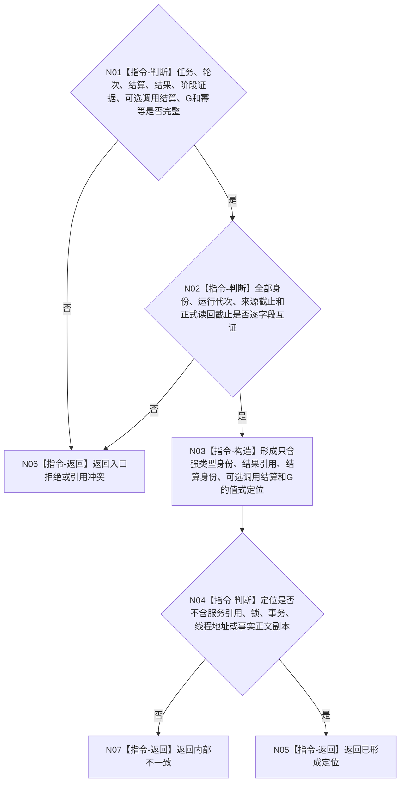

# BIZ-L3-004-08-05 形成任务轮次收束定位目标函数流程图 v0.1

更新时间：2026-08-26

## 依据

```text
0050、5090 v0.8、5160 v0.5、8100 v0.8、8200
BIZ-L2-004-08 v0.2、BIZ-L2-004-14
```

## 身份与边界

正式目标函数设计图。函数只把已经独立读回的任务、任务轮次、轮次结算、正式结果、可选上级调用结算和共同截止形成一份不可变 self 复核定位。它不提交邮箱、不读取需求、不形成 self 后继决议。

## 函数合同

```text
根函数：任务轮次收束定位形成器::形成任务轮次收束定位
归属模块 / 文件 / 目标分解深度：任务管理消息算法 / 海中鱼巣/线程/任务结果回执协议.ixx / BIZ-L3
现有或待新增：适配当前 manager 私有 `形成已收束任务结果复核消息`；拆分纯定位形成与004-14邮箱提交
完整签名：任务轮次收束定位结果 任务轮次收束定位形成器::形成任务轮次收束定位(const 任务轮次收束定位请求& 请求) const noexcept
参数：任务、任务轮次、轮次结算、正式结果、阶段收束证据、0..1调用槽结算、读取截止、运行代次和消息幂等身份
返回结果：已形成、入口拒绝、引用冲突或内部不一致；成功只携带值式定位消息
被调函数流程图：无；逐字段互证与值式构造均为本函数内指令
父图：BIZ-L2-004-08 v0.2；结果由父BIZ-L1-T03调用BIZ-L2-004-14提交
```

## 流程图



## 关键边界

- self 必须按显式任务轮次和轮次结算身份独立读回；不得按任务猜最近结算。
- 定位提交成功不等于 self 已形成继续/结束/等待/取消决议。
- 当前 manager 私有 helper直接构造完整自我治理消息；目标实现需保持唯一邮箱入口，但在业务分层上先形成定位、再由父T03调用004-14。
