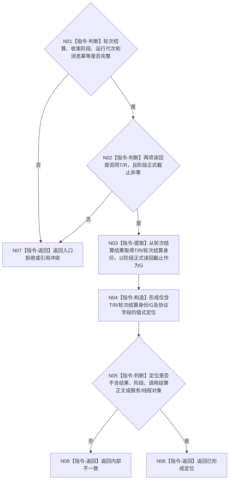

# BIZ-L3-004-08-05 形成任务轮次收束定位目标函数流程图 v0.2

更新时间：2026-08-27

## 依据与替代

```text
0050、5090、5160、8100、8200
BIZ-L2-004-08 v0.3、BIZ-L2-004-17 v0.3、BIZ-L2-004-14 v0.3
```

本图完整替代 v0.1。v0.1 错误要求定位携带正式结果、阶段证据和可选调用结算；v0.2 收敛为 self 唯一需要的显式定位：`任务 T / 任务轮次 R / 轮次结算身份 / 事实截止 G`，另保留消息协议必需的运行代次和幂等字段。

## 身份与边界

正式目标函数设计图。manager 只在任务轮次结算已形成 / 精确重复且正式读回、轮次已收束阶段也已正式读回后调用本函数。函数从轮次收束结果取得 `T / R / 轮次结算身份`，以阶段正式读回截止作为消息 `G`，形成不可变 self 复核定位。

函数不提交邮箱、不读取任务结果、不读取需求、不形成 self 后继决议，也不复制结果、阶段、调用返回或调用槽结算正文。

## 函数合同

```text
根函数：任务轮次收束定位形成器::形成任务轮次收束定位
归属模块 / 文件 / 目标分解深度：任务管理消息算法 / 海中鱼巣/线程/任务结果回执协议.ixx / BIZ-L3
现有或待新增：适配当前 manager 私有形成器；拆分纯定位形成与004-14邮箱提交
完整签名：任务轮次收束定位结果 任务轮次收束定位形成器::形成任务轮次收束定位(const 任务轮次收束定位请求& 请求) const noexcept
参数：已正式读回的轮次结算结果、已正式读回的轮次收束阶段结果、运行代次和消息幂等身份
返回结果：已形成、入口拒绝、引用冲突或内部不一致；成功只携带值式定位消息
被调函数流程图：无；逐字段互证与值式构造均为本函数内指令
父图：BIZ-L2-004-08 v0.3、BIZ-L2-004-17 v0.3；结果由父BIZ-L1-T03 v0.6调用BIZ-L2-004-14 v0.3提交
```

## 流程图



## 载荷白名单

```text
L2任务身份 任务
L2任务轮次身份 任务轮次
L2任务轮次结算身份 轮次结算
std::uint64_t 事实截止G
运行代次 / 消息幂等身份等现行消息协议字段
```

禁止携带：正式任务结果、合法无执行短路结果、执行轮次、当前实例、动作完成消息、阶段证据、调用返回、调用槽结算、需求核算或任一事实正文副本。

## 关键边界

- self 必须按显式 `轮次结算身份 + T + R + G` 调用正式读取入口，并逐字段互证；不得按任务猜最近结算。
- `G` 固定为轮次已收束阶段的正式读回截止，使 self 能在该截止读取已经永久存在的轮次结算；不得改用线程当前值或旧请求截止。
- 定位形成成功不等于邮箱提交成功，也不等于 self 已形成继续 / 结束 / 等待 / 取消决议。
