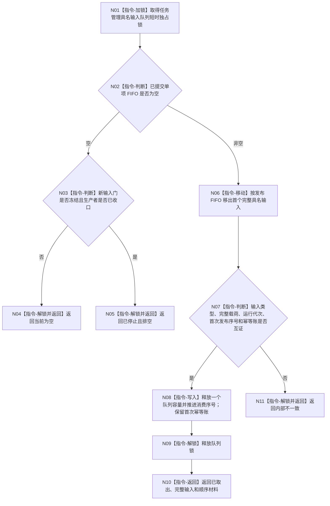

# BIZ-L3-004-09-01 尝试取出一个已提交任务管理具名输入目标函数流程图 v0.2

更新时间：2026-08-26

## 依据与替代

```text
4050、5090 v0.7、8100 v0.7
BIZ-L2-002-08 v0.2、BIZ-L2-004-09 v0.3
```

本图替代旧“尝试取出一个已确认任务治理输入组”v0.1。生产侧不再准备 / 确认消息组；每个已提交单项已经原子可见，消费者一次只移动一个完整具名输入。

## 身份与边界

正式目标函数设计图。函数只操作任务管理具名输入队列和本运行代次队列账，不复核业务事实、不拆分载荷、不调用 D 承接或 self 决议消费函数。

## 函数合同

```text
根函数：任务管理输入队列::尝试取出一个已提交任务管理具名输入
归属模块 / 文件 / 目标分解深度：任务管理输入队列 / 海中鱼巣/线程/任务管理输入队列.ixx / BIZ-L3
现有或待新增：待新增；与 BIZ-L3-002-08-02 v0.2 共用同一队列和幂等账
完整签名：任务管理具名输入取出结果 任务管理输入队列::尝试取出一个已提交任务管理具名输入() noexcept
参数：无；对象持有已提交单项 FIFO、运行代次、停止锁存、发布 / 消费顺序和首次幂等账
返回结果：按值返回；已取出、当前为空、已停止且排空或内部不一致，以及一个完整任务管理具名输入、首次发布序号和消费序号
被调函数流程图：无；加锁、移动、记账、解锁和返回均为本函数内指令
父图：BIZ-L2-004-09 v0.3
```

## 流程图



## 节点合同

| 节点 | 类型 | 输入 | 输出 | 事实读写 | 验证 |
| --- | --- | --- | --- | --- | --- |
| N01—N05 | 加锁 / 判断 / 返回 | 单项 FIFO 和停止状态 | 空或排空结果 | 只读队列状态 | 运行中空与停止后排空分离 |
| N06/N07 | 移动 / 判断 | 首个队列项、发布账和首次幂等账 | 完整输入或内部不一致 | 暂未删除账 | 恰一载荷；FIFO；发布序号单调 |
| N08—N10 | 写入 / 解锁 / 返回 | 已互证输入 | 已取出结果 | 只写队列容量和消费序号 | 首次幂等账保留；不携带锁 / 引用 |
| N11 | 返回 | 队列账冲突 | 内部不一致 | 不静默跳过坏项 | 停止依赖路径并保留诊断定位 |

## 关键边界

- 一个队列项就是最小可见和最小取出单元；不存在组内拆分、组游标、部分消费或候选确认状态。
- 取出只证明材料已经到达 T03。D 承接意图和 self 后继决议定位必须在队列锁外分别独立读回正式绑定事实。
- 同一首次发布项至多被正常取出一次；T03取出后必须把值式输入接管到自己的处理中槽，直至完成、同槽重试或具名停止接管，不能因后继暂时失败重新从队列取一份。
- 停止门冻结不删除已提交项；只有 FIFO 为空且生产侧已收口才返回已停止且排空。
