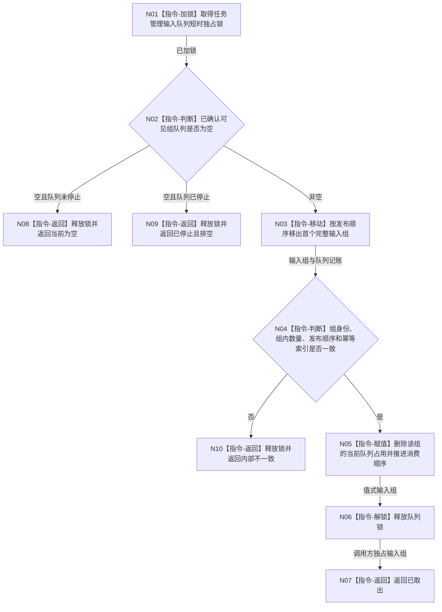

# BIZ-L3-004-09-01 尝试取出一个已确认任务治理输入组目标函数流程图 v0.1

更新时间：2026-08-03

## 依据

```text
4050、5090、8100；BIZ-L2-002-08、BIZ-L2-004-09
```

## 身份与边界

正式目标函数设计图。只从已经整组确认可见的自我下行队列中移动取得一个不可变任务治理输入组；不拆分组、不复核业务事实、不裁决任务阶段。

## 函数合同

```text
根函数：任务管理输入队列::尝试取出一个已确认任务治理输入组
归属模块 / 文件 / 层级：任务管理输入队列 / 海中鱼巣/线程/任务管理输入队列.ixx / L3
现有或待新增：待新增；复用准备、撤销、确认候选的同一队列与幂等索引
完整签名：自我任务治理输入取出结果 任务管理输入队列::尝试取出一个已确认任务治理输入组()
参数：无；对象拥有已确认组队列、运行代次、停止阶段和发布顺序记账
返回结果：调用方拥有的值式结果；含已取出、当前为空、已停止且排空或内部不一致，以及不可变任务治理输入组、来源队列版本和发布顺序
被调函数流程图：无；锁内检查、移动和队列记账均为本函数内指令
父图：BIZ-L2-004-09
```

## 流程图



## 节点合同

| 节点 | 类型 | 参数 / 输入绑定 | 结果 / 输出绑定 | 事实读写 | 后继条件 | 验证 |
| --- | --- | --- | --- | --- | --- | --- |
| N01—N03 | 指令 | 已确认组队列 | 空状态或一个完整输入组 | 只改队列占用 | 组为空或已移动 | 未确认候选不可见；整组恰一取得 |
| N04/N05 | 指令 | 输入组、幂等索引和顺序记账 | 一致消费见证 | 只写队列元数据 | 一致或内部不一致 | 不逐条拆组；错账停依赖路径 |
| N06/N07 | 指令 | 局部输入组 | 已取出结果 | 无业务写入 | 锁已释放 | 返回不携带锁、引用或迭代器 |
| N08—N10 | 指令-返回 | 队列状态 | 具名非成功 | 无业务写入 | 终止 | 空、停止和内部错误分离 |

## 关键边界

- `BIZ-L2-002-08` 确认的消息组是最小可见单元，本函数不得为了逐条公平而拆散同组原子可见性。
- 停止只禁止新组进入；停止前已确认组仍可被取出。空队列和已停止且排空必须分离。
- 取出成功只证明材料到达任务管理线程，不证明消息绑定事实、任务状态或许可成立。
