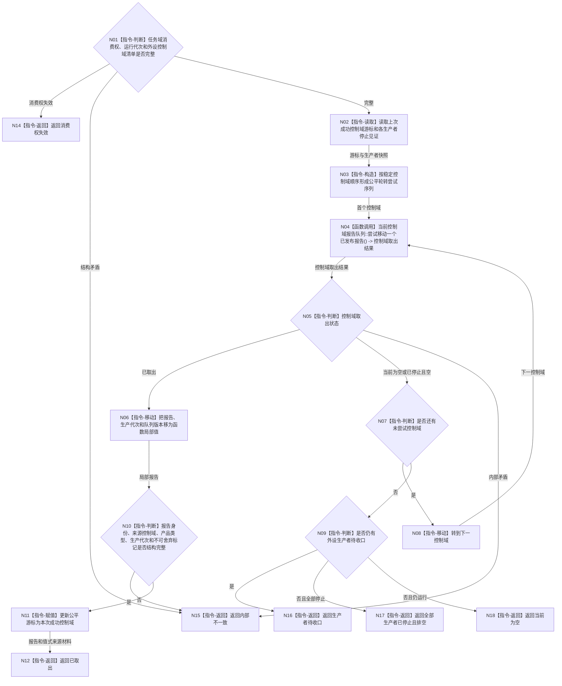

# BIZ-L3-004-09-02 尝试取出一个强类型外设报告目标函数流程图 v0.1

更新时间：2026-08-03

## 依据

```text
4050、5090、6340、8100；BIZ-L2-004-09 v0.3、BIZ-L2-004-10 v0.2、BIZ-L2-006-04 v0.2
```

## 身份与边界

正式目标函数设计图。任务域凭独占消费权从已登记外设控制域中公平移动取得一个强类型报告；只取得传递材料，不执行 6340 承接、事实提交或任务匹配。

## 函数合同

```text
根函数：任务外设报告消费端口::尝试取出一个强类型外设报告
归属模块 / 文件 / 层级：任务外设报告消费端口 / 海中鱼巣/线程/端口.任务外设报告消费.ixx / L3
现有或待新增：待新增；具体外设报告队列可复用，新增任务域唯一消费权和跨控制域公平选择
完整签名：外设报告取出结果 任务外设报告消费端口::尝试取出一个强类型外设报告()
参数：无；对象独占持有任务域消费权，绑定外设控制域稳定清单、各报告队列消费端口、运行代次和公平游标
返回结果：调用方拥有的值式结果；含已取出、当前为空、生产者待收口、全部生产者已停止且排空、消费权失效或内部不一致，以及强类型外设报告、来源控制域、生产代次、队列版本和取出顺序
被调函数流程图：BIZ-L4-004-09-02-01 双目相机报告队列尝试移动一个已发布报告；其它外设主题在正式登记后新增对应L4
父图：BIZ-L2-004-09
```

## 流程图



## 节点合同

| 节点 | 类型 | 参数 / 输入绑定 | 结果 / 输出绑定 | 事实读写 | 后继条件 | 验证 |
| --- | --- | --- | --- | --- | --- | --- |
| N01—N03 | 指令 | 独占消费权、控制域清单、游标 | 公平尝试序列 | 只读端口状态 | 合同完整 | 无消费权拒绝；稳定控制域顺序 |
| N04 | 函数调用 | 当前控制域消费端口 | 控制域取出结果 | 只移动一个报告队列项 | 调用完成 | 每控制域一个物理队列；短时锁 |
| N05—N09 | 指令 | 各控制域状态 | 已取出、空或收口状态 | 只写局部游标 | 本轮结束或继续 | 单源满载不饿死其它控制域 |
| N10—N12 | 指令 | 强类型报告和来源材料 | 已取出结果 | 只写公平游标 | 类型完整 | 不复制报告；不形成承接事实 |
| N14—N18 | 指令-返回 | 消费权和生产者状态 | 具名非成功 | 无业务写入 | 终止 | 空、待收口、排空和错误分离 |

## 关键边界

- 外设报告稳定身份仍是跨任务、窗口和代次的一次承接竞争键；本函数的取出顺序不能改变该唯一性。
- 取出不是 6340 正式承接。报告必须在锁外交给 `BIZ-L2-004-10 v0.2` 复核来源、时效、任务 / 等待 / 订阅 / 活跃需求匹配和一次承接。
- 不可静默舍弃报告不得因队列停止、任务管理暂无工作或其它来源持续满载而丢失；合法舍弃只能由后继强类型裁决形成。
