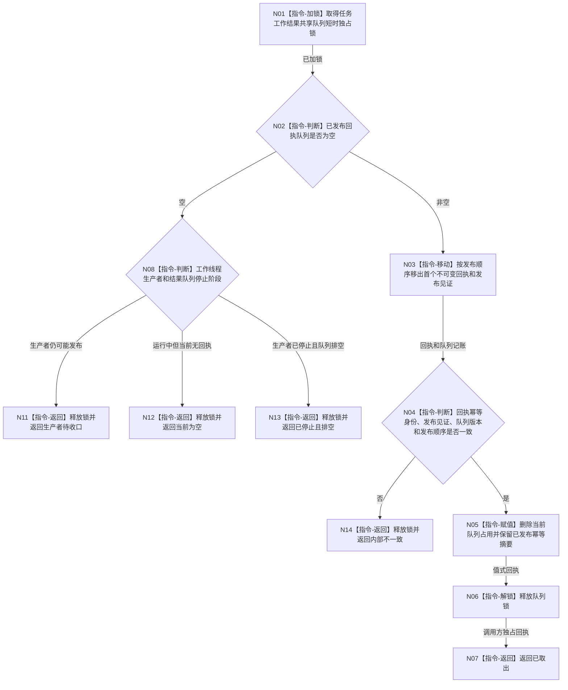

# BIZ-L3-004-09-03 尝试取出一个任务工作结果回执目标函数流程图 v0.1

更新时间：2026-08-03

## 依据

```text
4050、5090、8100；BIZ-L2-004-07、BIZ-L2-004-08、BIZ-L2-004-09
```

## 身份与边界

正式目标函数设计图。从任务工作线程池共享结果队列中移动取得一个已发布的不可变回执；不复核回执所声称的业务结果，不提交任务或需求事实。

## 函数合同

```text
根函数：任务工作结果队列::尝试取出一个任务工作结果回执
归属模块 / 文件 / 层级：任务工作结果队列 / 海中鱼巣/线程/任务工作结果队列.ixx / L3
现有或待新增：适配扩展；与发布或重试入口共用共享有界队列、幂等索引和停止阶段
完整签名：任务工作结果取出结果 任务工作结果队列::尝试取出一个任务工作结果回执()
参数：无；对象拥有已发布回执队列、幂等索引、运行代次和停止排空阶段
返回结果：调用方拥有的值式结果；含已取出、当前为空、生产者待收口、已停止且排空或内部不一致，以及不可变任务工作结果回执、发布见证、队列版本和发布顺序
被调函数流程图：无；锁内检查、移动和记账均为本函数内指令
父图：BIZ-L2-004-09
```

## 流程图



## 节点合同

| 节点 | 类型 | 参数 / 输入绑定 | 结果 / 输出绑定 | 事实读写 | 后继条件 | 验证 |
| --- | --- | --- | --- | --- | --- | --- |
| N01—N03 | 指令 | 共享结果队列 | 空状态或一个回执 | 只改队列占用 | 空或已移动 | 多生产者、单治理消费者、发布顺序稳定 |
| N04/N05 | 指令 | 回执、发布见证和幂等索引 | 一致消费见证 | 保留非权威幂等摘要 | 一致或内部不一致 | 取出不删除重复检测能力 |
| N06/N07 | 指令 | 局部回执 | 已取出结果 | 无业务写入 | 锁已释放 | 返回不携带锁或容器引用 |
| N08/N11—N14 | 指令 / 返回 | 生产者和停止状态 | 具名非成功 | 无业务写入 | 终止 | 当前空、待收口、已排空和错误分离 |

## 关键边界

- 停止阶段必须优先排空停止前已发布回执；任务工作线程停止不等于任务失败或任务已完成。
- 回执发布成功和取出成功都只是非权威传递事实。后继必须经 `BIZ-L2-004-08`、独立回读和任务领域提交收束。
- 本函数不能因回执损坏或业务结论不成立而重做筹办、方法动作或状态提交；结构矛盾返回内部不一致并停止该依赖路径。

