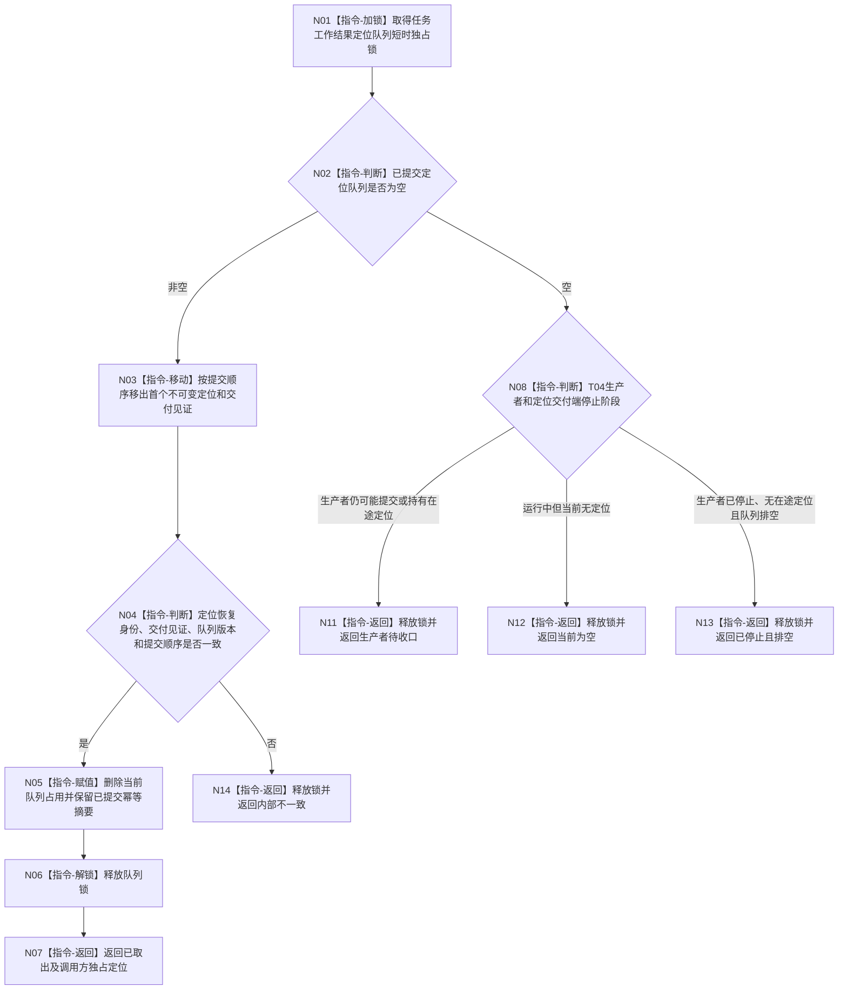

# BIZ-L3-004-09-03 尝试取出一个任务工作结果定位目标函数流程图 v0.2

更新时间：2026-08-27

## 依据与替代

```text
4050、5090、8100；BIZ-L2-004-07 v0.2、BIZ-L2-004-08 v0.3、BIZ-L2-004-09 v0.4
```

本图替代旧“尝试取出一个任务工作结果回执”v0.1。交付端只承载任务工作结果定位；旧回执不再是合法取出载荷。

## 函数合同

```text
根函数：任务工作结果定位交付端::尝试取出一个任务工作结果定位
归属模块 / 文件 / 目标分解深度：任务工作结果定位交付端 / 海中鱼巣/线程/任务工作结果定位交付端.ixx / BIZ-L3
现有或待新增：待新增；发布源码只有T04直接调用T03旧回执入口
完整签名：任务工作结果定位取出结果 任务工作结果定位交付端::尝试取出一个任务工作结果定位() noexcept
参数：无；对象拥有已提交定位队列、幂等索引、运行代次和停止排空阶段
返回结果：已取出、当前为空、生产者待收口、已停止且排空或内部不一致，以及不可变定位、交付见证、队列版本和提交顺序
被调函数流程图：无；锁内检查、移动和记账均为本函数内指令
父图：BIZ-L2-004-09 v0.3；BIZ-L2-004-08消费
```

## 流程图



## 关键边界

- 停止阶段必须排空停止边界前已经提交的定位；T04线程停止不等于任务失败、定位已消费或任务结果已形成。
- 取出只移动定位和交付见证，不在队列锁内读取动作完成消息、筹办事实、状态、动态或任务实际结果。
- 已提交幂等摘要必须保留，使T04重试同一定位仍可得到精确重复；不得因取出而把同键重试改成首次提交。
- 定位损坏或账不一致返回内部不一致，不能由本函数重做筹办、动作或事实提交，也不能退回旧回执。
