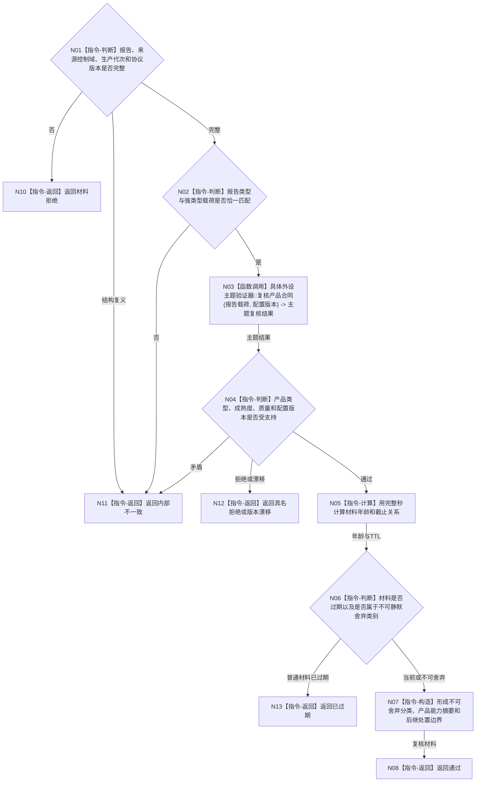

# BIZ-L3-004-10-01 复核外设报告合同目标函数流程图 v0.1

更新时间：2026-08-03

## 依据

```text
4050、6320、6340—6360；BIZ-L2-004-10
```

## 身份与边界

正式目标函数设计图。纯值复核一份强类型外设报告的来源、结构、版本、时效和不可舍弃分类；不读取任务，不消费报告，不写任何事实。

## 函数合同

```text
根函数：复核外设报告合同
归属模块 / 文件 / 层级：外设报告协议 / 海中鱼巣/线程/协议.外设报告.ixx / L3
现有或待新增：待新增通用合同；具体外设产品验证器由主题适配
完整签名：外设报告合同复核结果 复核外设报告合同(const 外设报告合同复核请求& 请求) noexcept
参数：请求为只读借用；含强类型报告、来源控制域身份、生产代次、当前完整秒、协议/产品/配置版本和主题验证器
返回结果：值式结果；含通过、材料拒绝、已过期、版本漂移或内部不一致，以及不可舍弃分类、材料年龄、产品能力摘要和后继处置边界
被调函数流程图：BIZ-L4-004-10-01-01 双目相机报告验证器复核产品合同；其它外设主题在正式登记后新增对应L4
父图：BIZ-L2-004-10
```

## 流程图



## 节点合同

| 节点 | 类型 | 参数 / 输入绑定 | 结果 / 输出绑定 | 事实读写 | 后继条件 | 验证 |
| --- | --- | --- | --- | --- | --- | --- |
| N01/N02 | 指令 | 报告头与载荷 | 基础合同资格 | 无写入 | 完整且恰一 | 缺字段、错类型、异义载荷 |
| N03 | 函数调用 | 主题载荷和配置版本 | 主题复核结果 | 无写入 | 调用完成 | 产品、成熟度、质量、版本矩阵 |
| N05/N06 | 指令 | 发生完整秒、当前完整秒和TTL | 时效分类 | 无写入 | 当前、过期或不可舍弃 | 不使用循环次数和队列等待次数 |
| N07/N08 | 指令 | 合同与时效结果 | 通过结果 | 无写入 | 完成 | 不升级为世界或任务事实 |
| N10—N13 | 指令-返回 | 具名非成功 | 结构化结果 | 无写入 | 终止 | 拒绝、漂移、过期和错误分离 |

## 关键边界

报告“可用”和主题验证通过都不证明任务匹配、世界事实或目标达成。安全事件、状态跃迁、跟踪丢失、外设错误和影响目标判断的缺口即使过期，也只能标记为不可静默舍弃并交后继治理。
