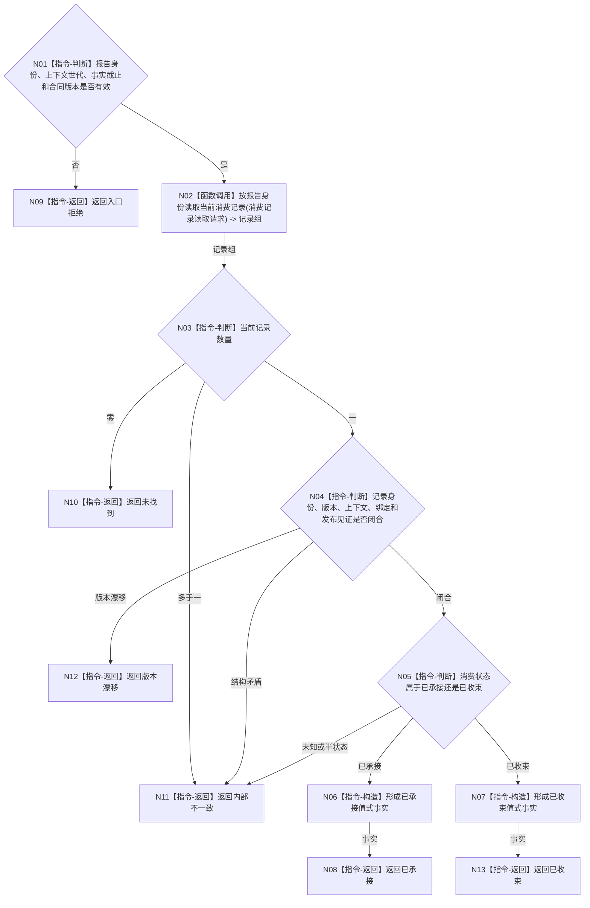

# BIZ-L3-004-10-02 读取同报告身份既有消费治理事实目标函数流程图 v0.1

更新时间：2026-08-03

## 依据

```text
4010、4050、6340、8100；BIZ-L2-004-10
```

## 身份与边界

正式目标函数设计图。按报告稳定身份读取跨任务、窗口和运行代次的当前消费治理事实，支持一次承接判重；只读任务域治理结构，不读取物理报告队列。

## 函数合同

```text
根函数：任务外设材料承接服务::读取同报告身份既有消费治理事实
归属模块 / 文件 / 层级：任务外设材料承接服务 / 海中鱼巣/领域/服务.任务外设材料承接.ixx / L3
现有或待新增：待新增；需要按报告稳定身份的唯一当前消费索引
完整签名：报告消费治理事实读取结果 任务外设材料承接服务::读取同报告身份既有消费治理事实(const 报告消费治理事实读取请求& 请求) const
参数：请求为只读借用；含报告稳定身份、运行期上下文世代、事实截止版本和期望消费合同版本
返回结果：调用方拥有的值式结果；含未找到、已承接、已收束、版本漂移或内部不一致，以及消费状态、绑定任务/工作项/窗口、消费版本、处理结果和发布见证
被调函数流程图：BIZ-L4-004-10-02-01 按报告身份读取当前消费记录
父图：BIZ-L2-004-10
```

## 流程图



## 节点合同

| 节点 | 类型 | 参数 / 输入绑定 | 结果 / 输出绑定 | 事实读写 | 后继条件 | 验证 |
| --- | --- | --- | --- | --- | --- | --- |
| N02 | 函数调用 | 报告身份和截止版本 | 当前记录组 | 只读消费治理结构 | 调用完成 | 跨代次同报告仍只有一个当前结论 |
| N03/N04 | 指令 | 记录组 | 唯一闭合记录 | 无写入 | 零、一或冲突 | 多当前和半发布为内部不一致 |
| N05—N08/N13 | 指令 | 唯一记录 | 已承接或已收束事实 | 无写入 | 状态合法 | 绑定和发布见证完整 |
| N09—N12 | 指令-返回 | 入口或结构问题 | 具名非成功 | 无写入 | 终止 | 不用未找到掩盖多当前 |

## 关键边界

任务、工作项、消费窗口和代次只用于解释既有绑定，不能与报告身份组合成放宽唯一性的复合竞争键。命中索引不等于读取成功，必须返回完整记录与发布见证。
