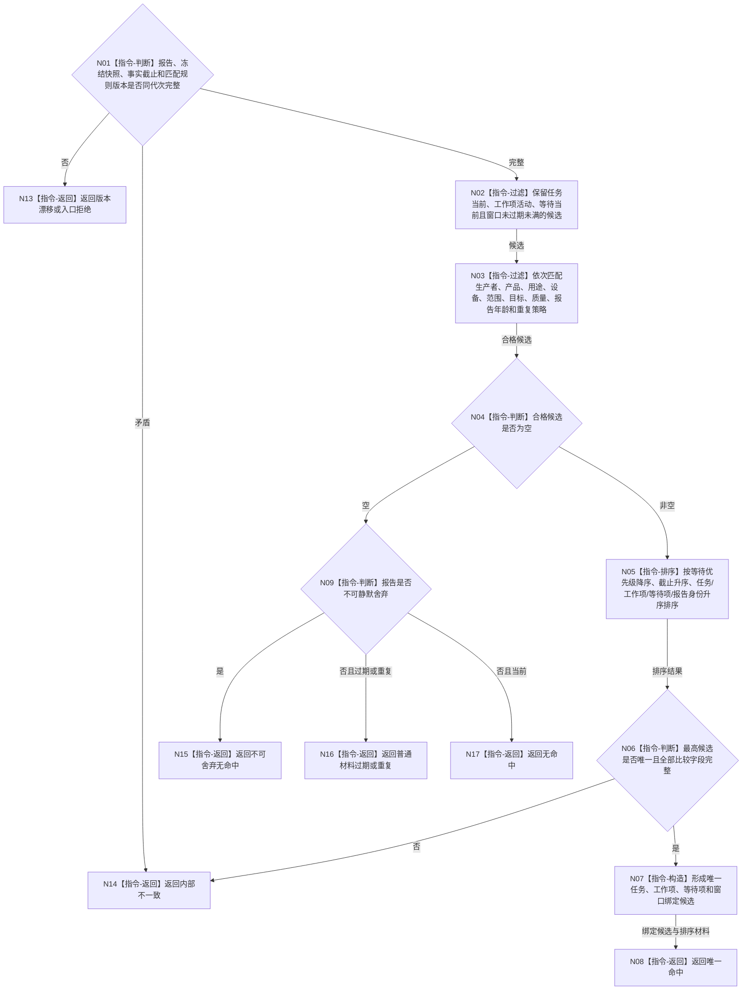

# BIZ-L3-004-10-03 匹配当前任务等待与订阅目标函数流程图 v0.1

更新时间：2026-08-03

## 依据

```text
5200、5210、5230、6340、8100；BIZ-L2-004-10
```

## 身份与边界

正式目标函数设计图。对冻结的任务、工作项、等待项和订阅窗口快照执行确定性纯值匹配；不消费报告、不迁移任务状态、不写世界事实。

## 函数合同

```text
根函数：任务外设材料承接服务::匹配当前任务等待与订阅
归属模块 / 文件 / 层级：任务外设材料承接服务 / 海中鱼巣/领域/服务.任务外设材料承接.ixx / L3
现有或待新增：待新增；复用任务权威读取，新增等待特征与消费窗口快照
完整签名：外设报告任务匹配结果 任务外设材料承接服务::匹配当前任务等待与订阅(const 外设报告任务匹配请求& 请求) const
参数：请求为只读借用；含已通过合同复核的报告、冻结任务/工作项/等待/订阅快照、事实截止、当前完整秒和匹配规则版本
返回结果：值式结果；含唯一命中、无命中、普通材料过期/重复、不可舍弃无命中、版本漂移或内部不一致，以及选中绑定、候选排序材料和具名原因
被调函数流程图：无；固定过滤和排序均为本函数内纯值指令
父图：BIZ-L2-004-10
```

## 流程图



## 节点合同

| 节点 | 类型 | 参数 / 输入绑定 | 结果 / 输出绑定 | 事实读写 | 后继条件 | 验证 |
| --- | --- | --- | --- | --- | --- | --- |
| N02/N03 | 指令 | 冻结快照和报告 | 合格候选 | 无写入 | 固定过滤完成 | 不因队列积压放宽匹配条件 |
| N04/N09 | 指令 | 合格候选和不可舍弃分类 | 无命中分支 | 无写入 | 候选为空 | 普通和不可舍弃材料分离 |
| N05/N06 | 指令 | 合格候选 | 唯一最高候选 | 无写入 | 排序闭合 | 确定性同值键；不使用线程号和队列位置 |
| N07/N08 | 指令 | 唯一候选 | 绑定候选 | 无写入 | 完成 | 一份报告最多绑定一个窗口 |
| N13—N17 | 指令-返回 | 非成功材料 | 具名结果 | 无写入 | 终止 | 拒绝、无命中、过期、不可舍弃和错误分离 |

## 关键边界

报告头中的等待提示只能缩小候选，不能绕过任务侧权威快照。匹配结果仍是未发布候选；“唯一命中”不证明材料已经承接、进入工作包或形成世界事实。

