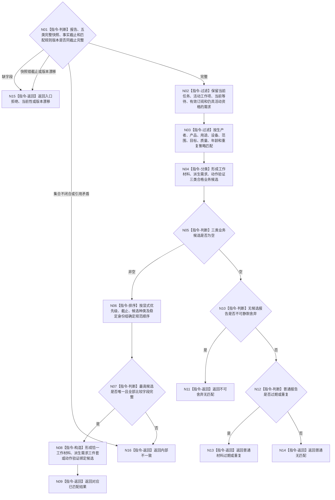

# BIZ-L3-004-10-03 匹配当前任务等待订阅与活跃需求目标函数流程图 v0.2

更新时间：2026-08-27

## 依据与替代

```text
3100、4250、5200、5210、5230、6340、8100；BIZ-L2-004-10 v0.2
```

本图完整替代 v0.1。旧图没有读取活跃需求，并把匹配结果限制为任务 / 工作项唯一命中、不可舍弃无命中和普通无命中，不能形成派生需求三件套或动作验证输入。

## 身份与边界

正式目标函数设计图。对同一事实截止冻结的当前任务、工作项、等待项、订阅项和活跃需求快照执行确定性纯值匹配，返回一项规范候选或具名无命中。它不消费报告、不迁移任务状态、不建立需求 / 任务、不写世界事实。

## 函数合同

```text
根函数：任务外设材料承接服务::匹配当前任务等待订阅与活跃需求
归属模块 / 文件 / 目标分解深度：任务外设材料承接服务 / 海中鱼巣/领域/服务.任务外设材料承接.ixx / BIZ-L3
现有或待新增：待新增；复用任务、等待、订阅和需求活动资格权威读取，新增纯值匹配组合
完整签名：外设报告任务匹配结果 任务外设材料承接服务::匹配当前任务等待订阅与活跃需求(const 外设报告任务匹配请求& 请求) const
参数：请求为只读借用；含已通过合同复核的报告、同截止冻结的任务 / 工作项 / 等待 / 订阅 / 活跃需求完整快照、当前完整秒和匹配规则版本
返回结果：值式结果；含已匹配工作材料、已匹配派生需求候选、已匹配动作验证、不可舍弃无匹配、普通无匹配、普通材料过期 / 重复、入口拒绝、当前性漂移、版本漂移或内部不一致，以及恰一选中绑定、确定性排序材料和具名原因
被调函数流程图：无；固定过滤、分类和排序均为本函数内纯值指令
父图：BIZ-L2-004-10 v0.2
```

## 流程图



## 节点合同

| 节点 | 类型 | 参数 / 输入绑定 | 结果 / 输出绑定 | 事实读写 | 后继条件 | 验证 |
| --- | --- | --- | --- | --- | --- | --- |
| N02/N03 | 指令 | 同截止五类快照和报告 | 合格基础候选 | 无写入 | 固定过滤完成 | 报告头提示只能缩小候选，不能补造任务或需求资格 |
| N04 | 指令 | 合格基础候选与产品类型 | 三类业务候选 | 无写入 | 分类完成 | 任务 / 等待 / 订阅可形成工作材料或动作验证；活跃需求只形成派生候选 |
| N05/N10/N12 | 指令 | 业务候选与不可舍弃 / 时效分类 | 无匹配分支 | 无写入 | 候选为空 | 不可舍弃、普通过期重复和普通无匹配分离 |
| N06/N07 | 指令 | 三类业务候选 | 唯一最高候选 | 无写入 | 排序闭合 | 使用稳定业务字段；不使用线程号、队列位置或遍历偶然顺序 |
| N08/N09 | 指令 | 唯一候选 | 恰一类型化绑定候选 | 无写入 | 完成 | 一份报告一次只形成一个待发布业务候选 |
| N11—N16 | 指令-返回 | 非成功或无匹配材料 | 具名结果 | 无写入 | 终止 | 拒绝、漂移、无匹配、过期和错误分离 |

## 关键边界

- 活跃需求必须来自同截止正式活动资格读取；不能从需求列表出现、报告内容或任务缺失反推。
- 派生需求三件套包含来源报告、目标候选和来源 / 归属材料的强类型引用，只供 self 后继治理；本函数不调用需求或任务建立入口。
- 动作验证输入必须绑定当前动作、工作项、对应命令 / 报告与验证合同；普通观察命中不得冒充动作验证。
- 报告头中的等待命中提示只能缩小候选，不能绕过任务、等待、订阅和活跃需求权威快照。
- “已匹配”仍是未发布候选，不证明材料已经承接、进入工作包、形成需求或成为世界事实。
