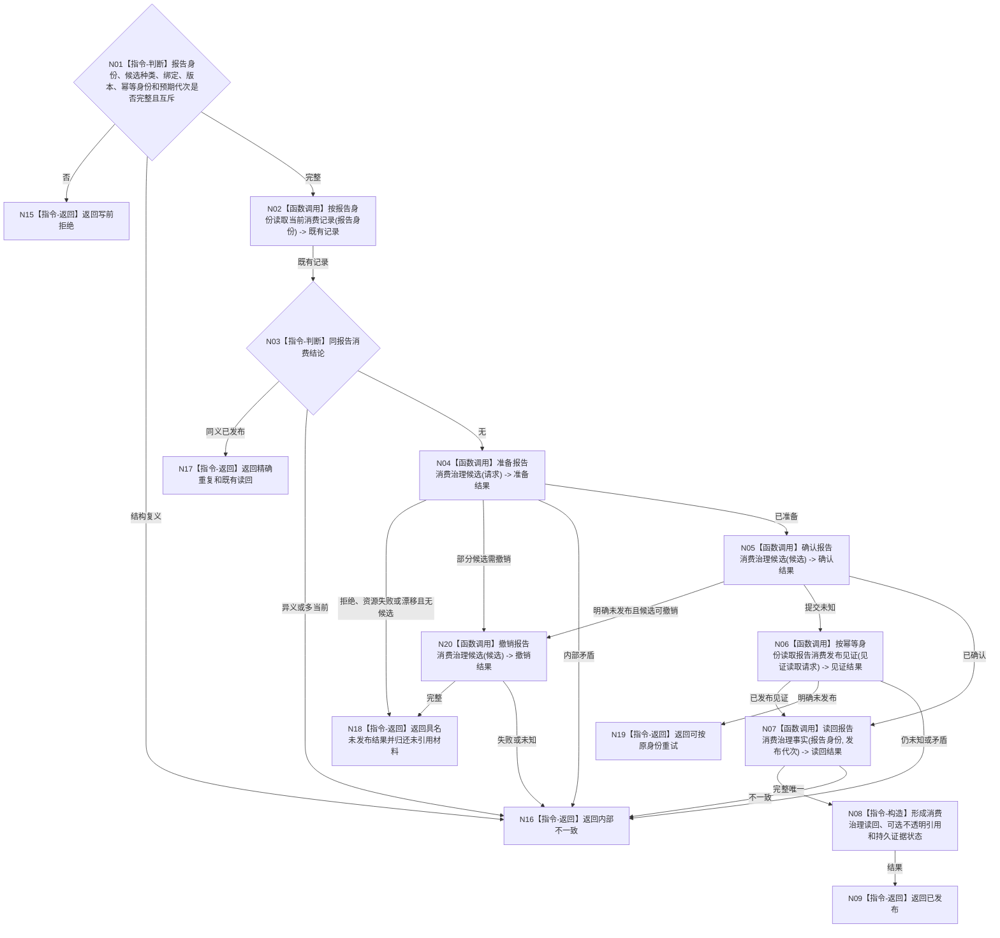

# BIZ-L3-004-10-04 发布报告一次承接事务目标函数流程图 v0.1

更新时间：2026-08-03

## 依据

```text
4010—4050、5230、6340、8100；BIZ-L2-004-10
```

## 身份与边界

正式目标函数设计图。按报告稳定身份原子发布一次消费治理结论：正式承接引用、不可舍弃收束或普通缓存/摘要/舍弃之一；不写任务生命周期、需求、世界、因果或价值事实。

## 函数合同

```text
根函数：任务外设材料数据操作::发布报告一次承接事务
归属模块 / 文件 / 层级：任务外设材料数据操作 / 海中鱼巣/领域/数据操作.任务外设材料承接.ixx / L3
现有或待新增：待新增；专用侧表、按报告唯一当前索引和事务参与者均待建立
完整签名：报告一次承接事务结果 任务外设材料数据操作::发布报告一次承接事务(报告一次承接事务请求&& 请求) noexcept
参数：请求为独占可移动值；含报告稳定身份、互斥处理候选、可选任务/工作项/等待/窗口绑定、来源材料引用、消费版本、幂等身份、预期事实代次和匹配规则版本
返回结果：调用方拥有的值式结果；含已发布、精确重复、写前拒绝、版本漂移、资源失败、提交未知或内部不一致，以及消费治理读回、可选不透明已承接材料引用、权威代次、发布见证和持久证据状态
被调函数流程图：当前记录读取复用BIZ-L4-004-10-02-01；BIZ-L4-004-10-04-01 准备报告消费治理候选；BIZ-L4-004-10-04-02 确认报告消费治理候选；BIZ-L4-004-10-04-03 撤销报告消费治理候选；BIZ-L4-004-10-04-04 按幂等身份读取报告消费发布见证
父图：BIZ-L2-004-10
```

## 流程图



## 节点合同

| 节点 | 类型 | 参数 / 输入绑定 | 结果 / 输出绑定 | 事实读写 | 后继条件 | 验证 |
| --- | --- | --- | --- | --- | --- | --- |
| N01—N03 | 判断 / 读取 | 请求和既有记录 | 写前资格 | 只读消费治理事实 | 无、重复或冲突 | 报告身份是唯一竞争键 |
| N04 | 函数调用 | 完整请求 | 不可见候选 | 准备侧表候选 | 已准备或未发布 | 三类候选互斥；绑定完整 |
| N05/N06 | 函数调用 | 候选、幂等身份 | 确认或发布见证 | 原子发布消费治理事实 | 已发布、未发布或错误 | 提交未知只按原身份收敛 |
| N07—N09 | 调用 / 构造 / 返回 | 报告身份和发布代次 | 完整读回 | 只读已发布事实 | 唯一完整 | 已承接引用不含报告副本、锁或指针 |
| N15—N19 | 指令-返回 | 具名非成功 | 结构化结果 | 明确未发布或未知 | 终止 | 材料引用状态和重试边界显式 |

## 关键边界

- 正式承接、不可舍弃收束和普通处置必须恰一发布；不能先写任务侧引用再补消费状态。
- 内存权威发布与持久证据分账；SQL或材料文件失败不得回滚已经发布的内存承接事实。
- 事务失败不得静默丢失不可舍弃材料。内部不一致必须隔离相关材料并停止依赖路径，不能包装成普通舍弃。
