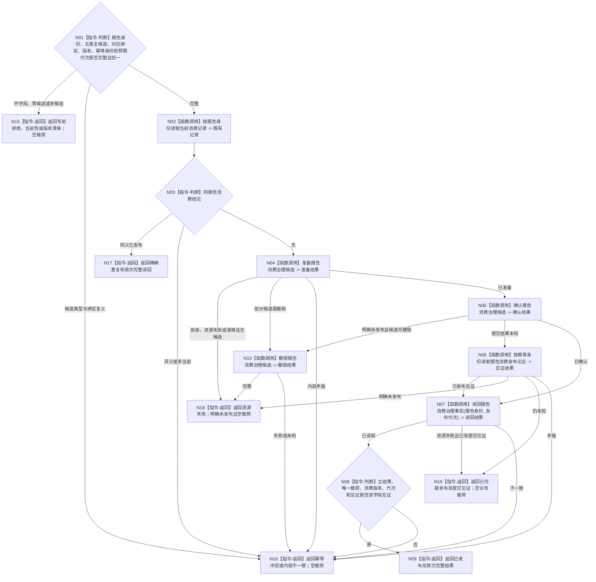

# BIZ-L3-004-10-04 发布报告一次承接事务目标函数流程图 v0.2

更新时间：2026-08-27

## 依据与替代

```text
4010—4050、5230、6340、8100；BIZ-L2-004-10 v0.2
```

本图完整替代 v0.1。旧图只允许正式承接引用、不可舍弃收束和普通处置三类候选；v0.2 将 6340 要求的四类业务承接产物与普通缓存 / 摘要 / 舍弃结果完整分账。

## 身份与边界

正式目标函数设计图。按报告稳定身份原子发布一次消费治理结论，主结果必须恰为：任务 / 工作项材料引用、派生需求三件套、动作验证输入、结构化缺口或普通处置之一。非权威最新报告缓存可随处理刷新，但不是第六类承接结果，不参与重放与唯一性。

本事务只发布任务域报告消费治理事实及其不透明材料引用，不建立需求、任务生命周期或世界事实；派生需求三件套的正式需求建立只能由后继需求 owner 完成。

## 函数合同

```text
根函数：任务外设材料数据操作::发布报告一次承接事务
归属模块 / 文件 / 目标分解深度：任务外设材料数据操作 / 海中鱼巣/领域/数据操作.任务外设材料承接.ixx / BIZ-L3
现有或待新增：待新增；专用侧表、按报告唯一当前索引和事务参与者均待建立
完整签名：报告一次承接事务结果 任务外设材料数据操作::发布报告一次承接事务(报告一次承接事务请求&& 请求) noexcept
参数：请求为独占可移动值；含报告稳定身份、五类互斥主候选、对应强类型绑定、来源材料引用、消费版本、幂等身份、预期事实代次和匹配规则版本；普通处置内部再区分仅缓存、摘要保留或已舍弃
返回结果：调用方拥有的值式结果；含已发布、精确重复、写前拒绝、当前性漂移、版本漂移、幂等冲突、资源失败、已可能发布或内部不一致，以及与主候选恰一对应的消费治理读回、可选不透明引用、权威代次和发布见证
被调函数流程图：BIZ-L4-004-10-02-01 v0.1 读取当前消费记录；BIZ-L4-004-10-04-01—04 v0.1 候选准备 / 确认 / 撤销和发布见证读取。上述 BIZ-L4 v0.1 仍使用旧三类候选措辞，后续 BIZ-L4 校正必须升级为本图五类主结果，不能作为当前实现已闭合证据
父图：BIZ-L2-004-10 v0.2
```

## 流程图



## 节点合同

| 节点 | 类型 | 参数 / 输入绑定 | 结果 / 输出绑定 | 事实读写 | 后继条件 | 验证 |
| --- | --- | --- | --- | --- | --- | --- |
| N01—N03 | 判断 / 读取 | 请求和既有记录 | 写前资格 | 只读消费治理事实 | 无、重复或冲突 | 报告身份是唯一竞争键；五类主结果恰一 |
| N04 | 函数调用 | 完整请求 | 不可见候选 | 准备侧表候选 | 已准备或未发布 | 每类载荷只含强类型引用；派生候选不建立需求 |
| N05/N06 | 函数调用 | 候选、幂等身份 | 确认或发布见证 | 原子发布消费治理事实 | 已发布、未发布或未知 | 提交未知只按原身份收敛 |
| N07—N09 | 调用 / 判断 / 返回 | 报告身份和发布代次 | 完整首次读回 | 只读已发布事实 | 唯一完整 | 状态、载荷、版本、代次与见证逐字段互证 |
| N10 | 函数调用 | 未公开候选 | 撤销结果 | 删除候选，不改正式事实 | 明确撤销 | 不丢失不可舍弃材料 |
| N15—N19 | 指令-返回 | 具名非成功或重复材料 | 结构化结果 | 明确未发布、已发布或可能发布 | 终止 | 资源失败、冲突和提交未知分离 |

## 主结果矩阵

| 主候选 | 必需载荷 | 禁止载荷 | 首次成功状态 |
| --- | --- | --- | --- |
| 任务 / 工作项材料引用 | 任务、工作项、可选等待 / 订阅绑定和不透明材料引用 | 派生需求、动作验证、缺口正文 | 已承接任务或工作项材料 |
| 派生需求三件套 | 来源报告、目标候选、来源 / 归属强类型引用 | 已建立需求或任务身份 | 已形成派生需求三件套 |
| 动作验证输入 | 当前动作、工作项、命令 / 报告和验证合同绑定 | 任务完成或目标满足结论 | 已形成动作验证输入 |
| 结构化缺口 | 缺口身份、影响范围、报告与证据截止 | 普通舍弃原因代替缺口 | 已形成结构化缺口 |
| 普通处置 | 仅缓存、摘要保留、已舍弃恰一及具名原因 | 四类业务承接载荷 | 对应普通处置状态 |

## 关键边界

- 五类主结果必须恰一发布；不能先写任务侧引用、派生候选或验证输入，再补消费状态。
- 非权威缓存刷新与主结果分账；缓存失败不能反向制造第二承接，缓存命中也不能替代正式读回。
- 内存权威发布与持久证据分账；材料文件失败不得回滚已经发布的内存承接事实。
- 事务失败不得静默丢失不可舍弃材料。内部不一致必须隔离相关材料并停止依赖路径，不能包装成普通舍弃。
