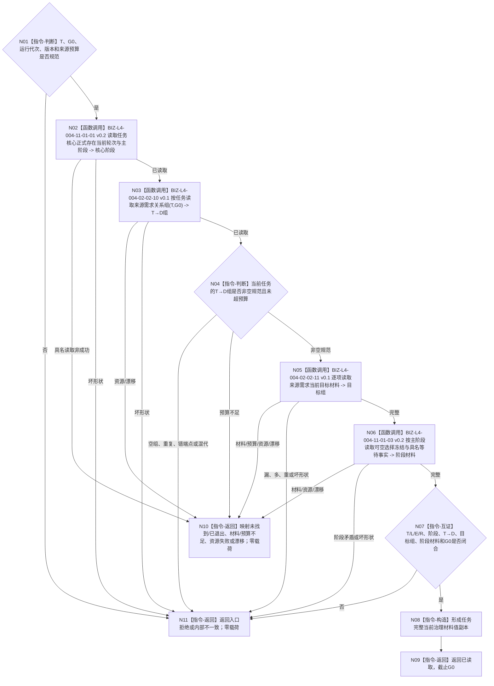

# BIZ-L3-004-11-01 读取任务完整当前治理材料目标函数流程图 v0.2

更新时间：2026-08-27

## 依据与替代

```text
0050、3200、4260 v0.9、5090、5210 v1.1、5230 v1.2
父图：BIZ-L2-004-11 v0.2
复用：BIZ-L4-004-02-02-10/11 v0.1
子图：BIZ-L4-004-11-01-01/03 v0.2
```

本图替代 v0.1“读取任务完整承接”。v0.1 的任务单目标、治理存在和旧治理状态全部退出；`BIZ-L4-004-11-01-02 v0.1` 也退出当前调用树，完整来源组统一复用 `BIZ-L4-004-02-02-10 v0.1`。

## 身份与边界

正式目标函数设计图。函数只在一个 `G0` 读取任务核心、正式存在、当前轮次、ARCH-L2当前主阶段、完整当前 `T→D`、逐来源当前目标材料及阶段要求的可空选择 / 实例 / 冻结 / 等待事实，并形成值式任务当前治理材料。它不读取需求父链，不比较多个需求目标，也不裁决父等待或下一阶段。

## 函数合同

```text
根函数：运行期只读查询组合器::读取任务完整当前治理材料
归属模块 / 文件 / 目标分解深度：运行期只读查询module-private组合 / 海中鱼巣/领域/组合.运行期只读查询.ixx / BIZ-L3
可见性：module-private；只由BIZ-L2-004-11 v0.2调用
现有或待新增：待新增；复用任务/存在/状态公开读与既有T→D、逐来源目标目标叶
完整签名：任务完整当前治理材料读取结果 运行期只读查询组合器::读取任务完整当前治理材料(const 任务完整当前治理材料读取请求& 请求) const noexcept
参数：T、运行代次、非零G0、任务/阶段/来源/目标/等待/读取规则版本和来源数量预算；不接受任务目标、治理存在或调用方来源组
返回结果：已读取时携带T及身份来源、L、正式T→E/E来源、当前任务轮次、当前主阶段、非空规范T→D、逐来源目标材料、阶段材料和截止G0；其它为未找到、已退出、材料/预算不足、资源失败、漂移、入口拒绝或内部不一致且零业务载荷；不产生许可拒绝
被调函数流程图：BIZ-L4-004-11-01-01 v0.2；BIZ-L4-004-02-02-10/11 v0.1；BIZ-L4-004-11-01-03 v0.2
```

## 流程图



## 节点合同

| 节点 | 类型 | 输入 | 输出 | 事实读写 | 验证 |
| --- | --- | --- | --- | --- | --- |
| N02 | BIZ-L4组合读取 | T、G0 | T/L/T→E/E/当前R/当前阶段 | 只读task、存在、状态owner | 0/1/>1、错端点、初始化窗口、漂移 |
| N03—N05 | 复用DATA/BIZ读取 | T、G0、预算 | 非空规范T→D与逐来源目标材料 | 只读task、需求和目标owner | 0/N、排序、每关系恰一目标、混版本 |
| N06 | 阶段读取 | 核心阶段、T/R/E、G0 | 可空选择/实例/冻结/等待事实 | 只读task及具名等待事实owner | 筹办前空、等待完整、执行冻结完整、阶段矛盾 |
| N07—N09 | 互证 / 构造 / 返回 | 全部读取结果 | 当前治理材料 | 无写入 | 所有身份、版本和截止逐字段一致 |

## 关键边界

- 查询锚点 `L` 只证明任务核心固定查询关系；完整来源只来自 `T→D`，不得枚举L成员补入。
- 每个 `T→D` 必须恰有一份同G0目标材料；本函数不选择第一来源、不合并预算/权重，也不把多个目标压成任务字段。
- 当前主阶段和阶段材料分账：ARCH-L2状态选择给出阶段，task / 等待owner给出该阶段要求的选择、冻结或等待事实；任何一方不能反推另一方。
- 本函数成功不表示任务可派发、父等待解除或需求目标满足。

## 当前代码实现对照

- 发布源码可复用任务读取和当前选择/实例读取；正式T→D、T→E、当前轮次公开生产读回仍缺失。
- 发布源码没有本module-private组合和阶段所需完整空见证 / 具名等待组合，旧任务治理状态不能替代。
