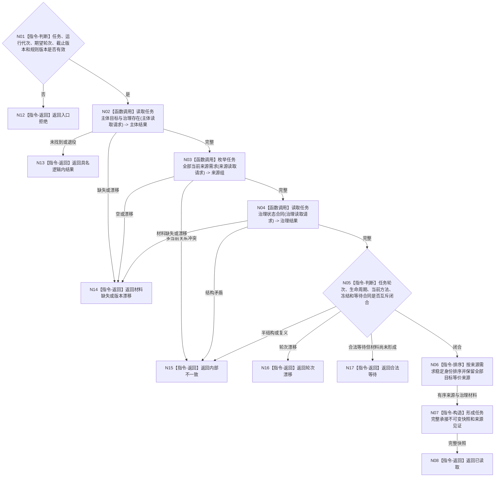

# BIZ-L3-004-11-01 读取任务完整承接目标函数流程图 v0.1

更新时间：2026-08-03

## 依据

```text
3200、5090、5200—5230、8100；BIZ-L2-004-11
```

## 身份与边界

正式目标函数设计图。按一个任务稳定身份读取其目标、全部目标等价来源、运行态治理存在、生命周期、当前方法、执行冻结、等待合同和轮次；只读任务领域当前事实。

## 函数合同

```text
根函数：任务业务服务::读取任务完整承接
归属模块 / 文件 / 层级：任务领域服务 / 海中鱼巣/领域/服务.任务.ixx / L3
现有或待新增：适配扩展；复用现行任务权威材料读取并补齐多来源、等待合同和轮次
完整签名：任务完整承接读取结果 任务业务服务::读取任务完整承接(const 任务完整承接读取请求& 请求) const
参数：请求为只读借用；含任务稳定身份、运行代次、期望任务轮次、事实截止版本和任务承接规则版本
返回结果：调用方拥有的不可变值式结果；含已读取、未找到、已退役、合法等待、材料缺失、轮次漂移、版本漂移或内部不一致，以及目标、全部来源需求、治理存在、生命周期、当前方法、执行冻结、等待合同、任务版本和来源见证
被调函数流程图：BIZ-L4-004-11-01-01 读取任务主体目标与治理存在；BIZ-L4-004-11-01-02 枚举任务全部当前来源需求；BIZ-L4-004-11-01-03 读取任务治理状态合同
父图：BIZ-L2-004-11
```

## 流程图



## 节点合同

| 节点 | 类型 | 参数 / 输入绑定 | 结果 / 输出绑定 | 事实读写 | 后继条件 | 验证 |
| --- | --- | --- | --- | --- | --- | --- |
| N02 | 函数调用 | 任务和截止版本 | 主体、目标、治理存在 | 只读任务事实 | 完整或具名非成功 | 任务主体与治理存在恰一 |
| N03 | 函数调用 | 任务身份 | 全部当前来源需求 | 只读任务来源关系 | 非空且无冲突 | 不只取第一来源，不混入历史关系 |
| N04/N05 | 调用 / 判断 | 任务治理材料 | 当前状态合同 | 只读任务/方法事实 | 闭合、等待、漂移或错误 | 生命周期、轮次、冻结和等待互斥 |
| N06—N08 | 指令 | 来源和治理材料 | 不可变完整快照 | 无写入 | 完成 | 确定顺序仅用于稳定输出 |

## 关键边界

任务列表位置、线程占用、队列项和日志不是任务承接事实。来源需求必须全部保留；不同来源的权重、权限和预算不能在本函数中合并成单值。
