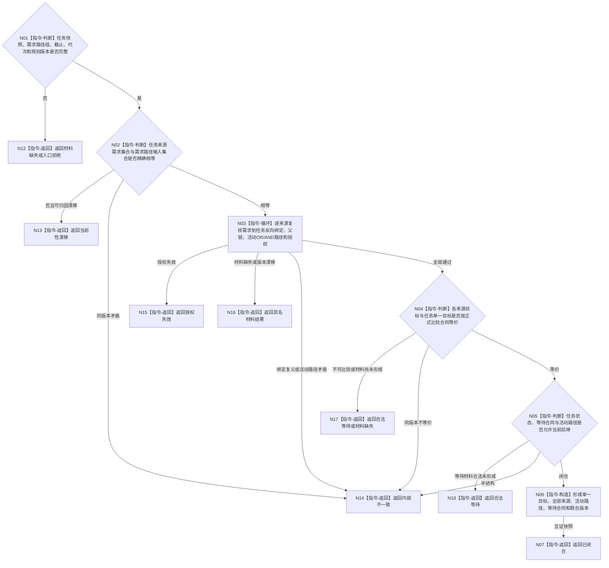

# BIZ-L3-004-11-02 联合复核任务需求互证目标函数流程图 v0.1

更新时间：2026-08-03

## 依据

```text
3100、3200、5090—5120、5200—5230；BIZ-L2-004-11；复用BIZ-L3-002-04-02
```

## 身份与边界

正式目标函数设计图。纯值复核任务完整承接与全部来源需求活动路径是否双向一致、目标等价、授权当前并共享同一事实截止；不访问仓库，不形成第二份任务或需求事实。

## 函数合同

```text
根函数：联合复核任务需求互证
归属模块 / 文件 / 层级：任务需求互证算法 / 海中鱼巣/领域/算法.任务需求互证.ixx / L3
现有或待新增：待新增；复用任务完整承接和需求父链活动路径值式快照
完整签名：任务需求互证结果 联合复核任务需求互证(const 任务需求互证请求& 请求) noexcept
参数：请求为只读借用；含任务完整承接、每个来源需求的父链活动路径结果、事实截止、运行代次和互证规则版本
返回结果：值式结果；含已闭合、合法等待、授权失效、材料缺失、当前性漂移、版本漂移或内部不一致，以及单一目标合同、全部来源绑定、活动路径、等待合同和联合来源版本
被调函数流程图：无；集合比较、版本互证和目标等价裁决均为本函数内纯值指令
父图：BIZ-L2-004-11
```

## 流程图



## 节点合同

| 节点 | 类型 | 参数 / 输入绑定 | 结果 / 输出绑定 | 事实读写 | 后继条件 | 验证 |
| --- | --- | --- | --- | --- | --- | --- |
| N02 | 指令 | 两侧来源集合 | 集合互证 | 无写入 | 相等、漂移或错误 | 双向全集，不比较列表位置 |
| N03 | 指令-循环 | 每个来源与路径 | 逐来源互证 | 无写入 | 全部通过或具名非成功 | OR/AND、授权、父链和反向绑定 |
| N04/N05 | 指令 | 目标、状态、等待和路径 | 联合后继资格 | 无写入 | 等价、等待或错误 | 不用裸值统一减法，不把子完成当父完成 |
| N06/N07 | 指令 | 互证材料 | 不可变联合快照 | 无写入 | 完成 | 全部来源版本可回查 |

## 关键边界

本函数只做值式互证，不能修复任一领域的半结构。权重、权限和预算保持逐来源材料；只有后继阶段裁决函数可以消费它们，不能在这里选第一来源或求和。
