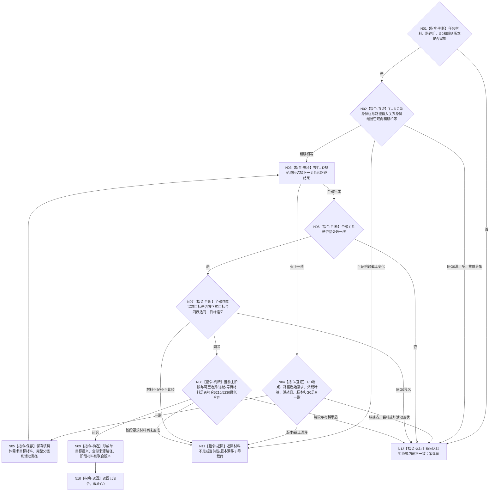

# BIZ-L3-004-11-02 联合复核任务需求互证目标函数流程图 v0.2

更新时间：2026-08-27

## 依据与替代

```text
0050、3100、3200、4260 v0.9、5090、5210 v1.1、5220 v0.2、5230 v1.2
父图：BIZ-L2-004-11 v0.2
输入：BIZ-L3-004-11-01 v0.2、BIZ-L3-004-11-03 v0.3的值式结果
```

本图替代 v0.1。旧图把任务单一目标副本、通用授权和等待后继裁决纳入互证；v0.2只验证当前 `T→D` 全集、每个具体需求目标、活动路径和任务阶段材料是否在同一 `G0` 闭合。任务目标由逐需求目标互证产生，不与任务字段比较；父等待和下一阶段由后继函数裁决。

## 身份与边界

正式纯值目标函数。函数不访问仓库、不修补输入、不发布任何事实。它把任务当前治理材料中的规范 `T→D` 组与逐来源父链/活动路径组做双向全集互证，逐项验证关系端点、需求身份和版本，再按正式目标合同判断全部当前具体需求是否表达同一任务目标。

## 函数合同

```text
根函数：运行期只读查询组合器::联合复核任务需求互证
归属模块 / 文件 / 目标分解深度：运行期只读查询module-private纯值算法 / 海中鱼巣/领域/组合.运行期只读查询.ixx / BIZ-L3
可见性：module-private；只由BIZ-L2-004-11 v0.2调用
现有或待新增：待新增；纯值集合、身份、版本和阶段合同互证
完整签名：任务需求互证结果 运行期只读查询组合器::联合复核任务需求互证(const 任务需求互证请求& 请求) const noexcept
参数：BIZ-L3-004-11-01 v0.2完整任务材料、与每条T→D一一绑定的BIZ-L3-004-11-03 v0.3路径组、G0和互证规则版本
返回结果：已闭合、材料不足、当前性漂移、版本漂移、入口拒绝或内部不一致；已闭合时携带由逐需求目标互证出的单一目标语义、完整来源绑定、活动路径组、阶段材料引用、联合版本和G0；其它状态零业务载荷
被调函数流程图：无；仅做规范排序、集合等值、逐字段绑定和正式目标合同同义判断
```

## 流程图



## 节点合同

| 节点 | 类型 | 输入 | 输出 | 事实读写 | 验证 |
| --- | --- | --- | --- | --- | --- |
| N01/N02 | 判断 / 集合互证 | 任务T→D和路径输入 | 双向全集结论 | 无写入 | 0/N、漏、多、重、关系身份顺序 |
| N03—N06 | 循环 / 逐项互证 | 每条关系、目标和路径 | 全部来源绑定 | 无写入 | T/D端点、根到叶、活动组、G0和版本 |
| N07 | 正式目标同义判断 | 各具体需求目标材料 | 单一任务目标语义 | 无写入 | 同一宿主/特征/目标合同语义；不比较任务副本 |
| N08 | 阶段合同判断 | ARCH-L2阶段和阶段材料 | 完整阶段材料引用 | 无写入 | 筹办前空、等待具名、冻结/执行非空、收束停止 |
| N09/N10 | 构造 / 返回 | 全部互证结果 | 不可变联合快照 | 无写入 | 不合并来源权重/预算，不裁决后继 |

## 关键边界

- 任务没有可供比较的目标副本；“单一目标”仅是当前非空 `T→D` 所指具体需求目标的同义投影。
- 父链和活动路径只证明需求树当前位置及活动阻塞材料，不直接证明父任务等待解除或目标满足。
- 通用授权、安全调度、现实执行授权和硬否决均不属于本函数输入。
- 同G0目标异义、错端点或阶段矛盾是内部不一致，不得选第一项、求和或降格为合法等待。
