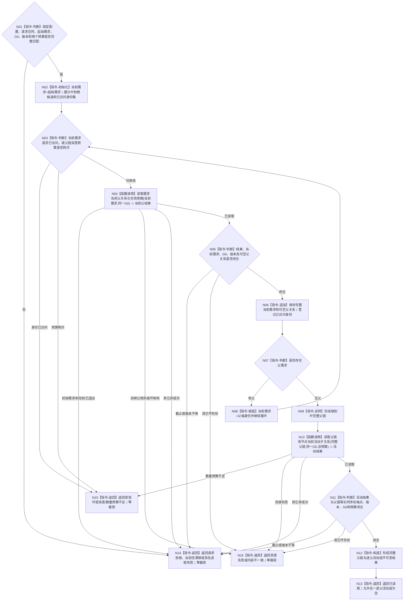

# BIZ-L3-004-11-03 读取需求父链与活动路径事实目标函数流程图 v0.3

更新时间：2026-08-26

## 依据与迁移

```text
0050、3100、5100、5110、5160、4015；BIZ-L2-004-11
BIZ-L4-004-11-03-01 v0.3；BIZ-L4-004-11-03-02 v0.3
```

本图由旧 BIZ-L3-002-04-02 v0.2 迁入任务完整承接读取子树。002-04只绑定任务实际结果，不再拥有需求父链；004-11及其它明确需要需求树当前路径的消费者统一复用本身份。

## 函数合同

```text
根函数：需求业务服务::读取需求父链与活动路径事实
归属模块 / 文件 / 目标分解深度：需求业务服务 / 海中鱼巣/领域/服务.需求.ixx / BIZ-L3
现有或待新增：待新增；组合两个 BIZ-L4 v0.3 读取叶
完整签名：需求父链活动路径读取结果 需求业务服务::读取需求父链与活动路径事实(const 需求父链活动路径读取请求& 请求) const noexcept
参数：合同版本、运行代次、事实/需求范围版本、需求树/父关系/路径/活动/读取规则版本、起始需求、非零G0、父链深度预算和当前子关系总数量预算；版本匹配服务固定配置
返回结果：已读取时携带根到叶完整当前父链及同序逐父当前活动子关系组；初始需求未找到/已退出、深度/数量预算不足、发现环、漂移或其它非成功均零业务载荷
被调函数流程图：BIZ-L4-004-11-03-01 v0.3；BIZ-L4-004-11-03-02 v0.3
父图：BIZ-L2-004-11；BIZ-L2-002-06 v0.2 只复用其中“当前直接父关系”读取叶；可由明确需要同一需求树路径事实的其它图复用
```

## 流程图



## 节点合同

| 节点 | 类型 | 参数 / 输入绑定 | 结果 / 输出绑定 | 事实读写 | 后继条件 | 验证 |
| --- | --- | --- | --- | --- | --- | --- |
| N01—N03 | 判断 / 初始化 | 起始需求、G0、版本和两个预算 | 当前需求、叶到根候选、已访问身份集 | 无写入 | 拒绝、发现环 / 超限或继续读取 | 合同、版本、截止和预算逐字段有效；不接受零 G0 |
| N04—N08 | 函数调用 / 判断 / 追加 / 赋值 | 当前需求和同一 G0 | 完整当前需求、可空唯一父关系、下一父端 | 只经 BIZ-L4-004-11-03-01 读取需求当前事实 | 有父继续，无父结束父链，非成功分账 | 子端、父端、生命周期、版本和 G0 逐项互证；不从历史或顺序补父 |
| N09—N13 | 反转 / 函数调用 / 判断 / 构造 / 返回 | 根到叶完整父链、同一 G0、总数量预算 | 同序逐父当前活动子关系组和完整成功结果 | 只经 BIZ-L4-004-11-03-02 读取当前活动关系 | 成功或具名非成功 | 父链与活动组等长同序；空活动组合法；任何失败零前缀 |
| N14—N16 | 返回 | 入口、读取、预算、资源或结构错误 | 结构化非成功 | 无额外写入 | 返回父图 | 初始未找到、后继父缺失、漂移、环和资源失败不得混写 |

## 关键边界

- 父链只由同一 `G0` 的可空唯一当前父关系逐项形成；无父是完整空结果，后继父缺失属于内部不一致。
- 活动组只由完整父链的一次有界读取形成；本函数不直达 L1、不读取历史、不按权重、任务状态或顺序补造活动结论。
- 环、深度预算、总数量预算和资源失败分账；任何非成功均不返回截断父链或前缀活动组。
- 本共享能力不因物理迁移到004-11而取得任务 owner 写权；全程只读需求公开服务。
