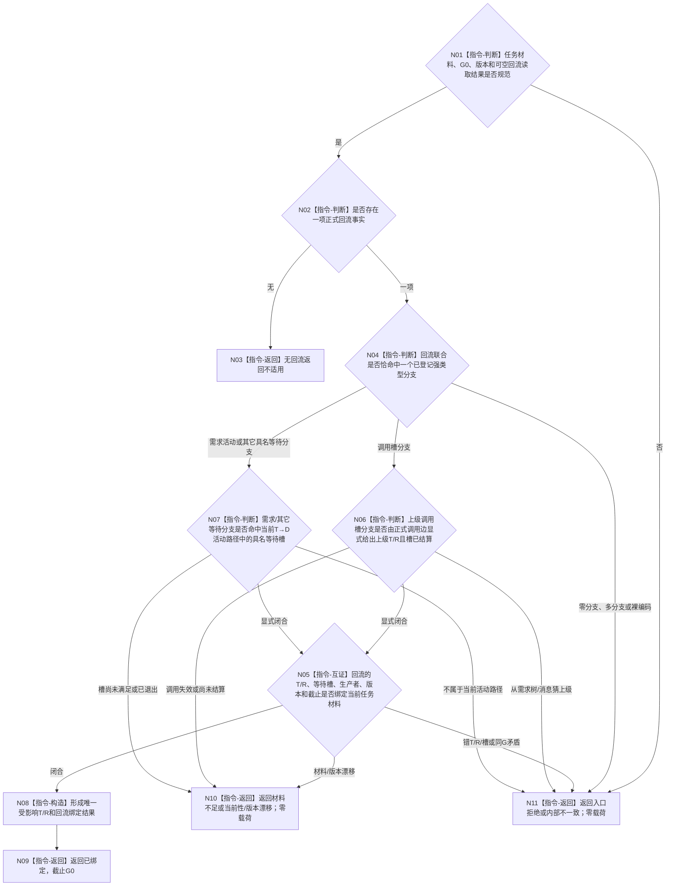

# BIZ-L3-004-12-01 复核单项具名回流与受影响任务绑定目标函数流程图 v0.2

更新时间：2026-08-27

## 依据与替代

```text
0050、4260 v0.9、5090 v0.7、5210 v1.1、5220 v0.2、5230 v1.2
父图：BIZ-L2-004-12 v0.2
输入：BIZ-L2-004-11 v0.2完整任务材料；正式owner已读回的可空单项具名回流结果
```

本图替代 v0.1“复核单项回流触发事实”。旧图信任调用方携带的父任务与父等待摘要，并在纯值函数中判断“是否触发过”；v0.2只互证正式读回事实与当前T/R/具名等待槽，不建立第二去重账。

## 身份与边界

正式 module-private 纯值目标函数。函数接受可空回流读取结果：无回流是普通不适用；有回流时必须恰好属于一个正式来源分支，并逐字段绑定当前任务、当前任务轮次、等待槽、事实截止和规则版本。消息、子任务结束枚举、需求父关系或结果相似性不能代替正式回流事实。

## 函数合同

```text
根函数：任务等待回流重判组合器::复核单项具名回流与受影响任务绑定
归属模块 / 文件 / 目标分解深度：任务等待回流纯值算法 / 海中鱼巣/领域/内部治理/服务.任务等待回流重判.ixx / BIZ-L3
可见性：module-private；只由BIZ-L2-004-12 v0.2调用
现有或待新增：待新增；HEAD旧provider直接从父需求/列表项推任务，不能复用
完整签名：任务具名回流绑定复核结果 任务等待回流重判组合器::复核单项具名回流与受影响任务绑定(const 任务具名回流绑定复核请求& 请求) const noexcept
参数：004-11完整任务材料、可空正式回流读取结果、G0和规则版本；回流联合只允许正式上级调用槽结算、需求活动承接回流或当前具名等待条件事实等已登记分支
返回结果：已绑定、不适用、材料不足、当前性/版本漂移、入口拒绝或内部不一致；已绑定携带T/R、等待槽、触发分支/身份/版本和G0
被调函数流程图：无；正式事实必须由父图上游先经对应owner独立读回
```

## 流程图



## 关键边界

- 需求父关系只定位需求树，不定位任务父子；明确上级任务只能来自正式发起调用及调用槽。
- 同一回流重复到达只会再次读回同一事实并产生同义值式结果；本函数不建立“已经触发过”第二账。
- 无回流是不适用，不是等待、材料不足或错误；有回流却错T/R/槽是内部不一致，不能静默当作不相关。
