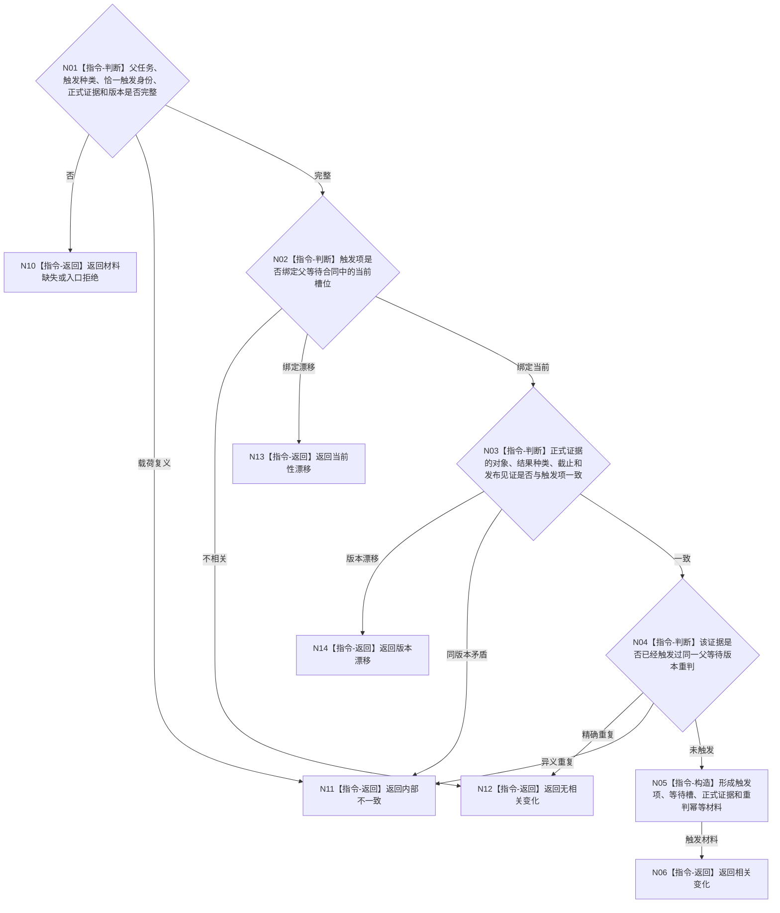

# BIZ-L3-004-12-01 复核单项回流触发事实目标函数流程图 v0.1

更新时间：2026-08-03

## 依据

```text
4050、5090、5110、5210、5220、8100；BIZ-L2-004-12
```

## 身份与边界

正式目标函数设计图。纯值复核一个子任务、子需求或等待条件回流是否真实绑定当前父任务等待合同并足以触发一次重判；不读取仓库，不迁移父任务。

## 函数合同

```text
根函数：复核单项回流触发事实
归属模块 / 文件 / 层级：父任务等待重判算法 / 海中鱼巣/领域/算法.父任务等待重判.ixx / L3
现有或待新增：待新增；复用正式子结果、需求活动变化和等待条件值式材料
完整签名：父任务回流触发复核结果 复核单项回流触发事实(const 父任务回流触发复核请求& 请求) noexcept
参数：请求为只读借用；含父任务、触发种类、子任务/子需求/等待项恰一身份、正式结果证据、父等待合同摘要、事实截止、触发版本和规则版本
返回结果：值式结果；含相关变化、无相关变化、材料缺失、当前性漂移、版本漂移或内部不一致，以及触发项、对应等待槽、正式证据引用和重判幂等材料
被调函数流程图：无；类型、绑定、版本和证据集合复核均为本函数内纯值指令
父图：BIZ-L2-004-12
```

## 流程图



## 节点合同

| 节点 | 类型 | 参数 / 输入绑定 | 结果 / 输出绑定 | 事实读写 | 后继条件 | 验证 |
| --- | --- | --- | --- | --- | --- | --- |
| N01/N02 | 指令 | 触发材料和父等待摘要 | 绑定资格 | 无写入 | 当前、不相关或漂移 | 子结束枚举和消息到达不自证相关 |
| N03 | 指令 | 正式结果证据 | 证据资格 | 无写入 | 一致、漂移或错误 | 发布见证、对象和结果种类互证 |
| N04—N06 | 指令 | 触发和既有重判摘要 | 唯一重判触发材料 | 无写入 | 未触发 | 精确重复不重复增加轮次 |

## 关键边界

一项子结果只负责触发重判，不证明父任务目标达成。线程回执、队列顺序和子任务结束枚举都不能替代正式结果证据。

