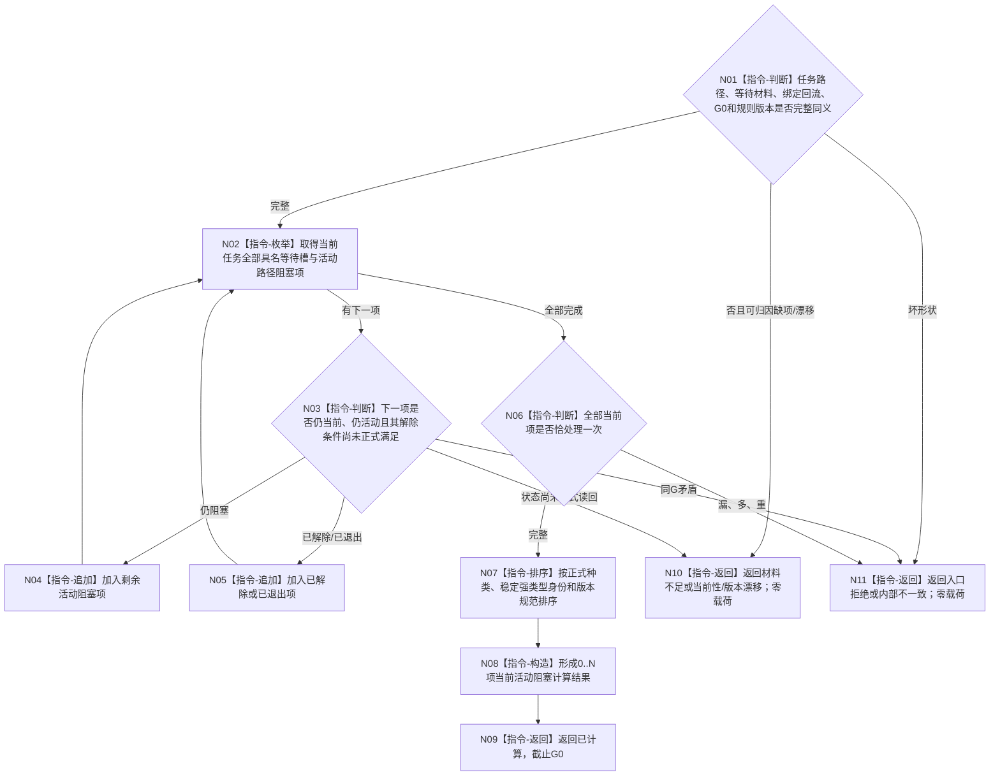

# BIZ-L3-004-12-02 计算受影响任务当前活动阻塞项目标函数流程图 v0.2

更新时间：2026-08-27

## 依据与替代

```text
3100、3200、4260 v0.9、5210 v1.1、5220 v0.2
父图：BIZ-L2-004-12 v0.2
输入：BIZ-L2-004-11 v0.2完整活动路径/具名等待材料；BIZ-L3-004-12-01 v0.2绑定结果
```

本图替代 v0.1“计算父任务剩余活动阻塞项”。当前阻塞对象属于任务当前具名等待合同和需求活动路径，不是任务子节点；历史需求、已退出活动承接和已结算调用槽不得继续阻塞。

## 函数合同

```text
根函数：任务等待回流重判组合器::计算受影响任务当前活动阻塞项
归属模块 / 文件 / 目标分解深度：任务等待回流纯值算法 / 海中鱼巣/领域/内部治理/服务.任务等待回流重判.ixx / BIZ-L3
可见性：module-private；只由BIZ-L2-004-12 v0.2调用
现有或待新增：待新增纯值算法
完整签名：任务当前活动阻塞计算结果 任务等待回流重判组合器::计算受影响任务当前活动阻塞项(const 任务当前活动阻塞计算请求& 请求) const noexcept
参数：004-11完整任务材料、已绑定单项回流、G0和阻塞规则版本；不接收调用方声明的阻塞集合
返回结果：已计算、材料不足、当前性/版本漂移、入口拒绝或内部不一致；已计算携带规范有序剩余阻塞项、已解除项和G0，0项为合法完整结果
被调函数流程图：无；只对同G0已读回材料做集合和路径计算
```

## 流程图



## 关键边界

- 单项回流后立即重算，不等待同层全部项整批结束。
- 0项阻塞只表示当前等待已解除；它不证明目标满足，也不直接允许执行或发布新筹办事实。
- OR/AND活动路径只消费需求owner正式事实；本函数不改选活动路径、不复制调用结果，也不建立跨需求活动集事务。
