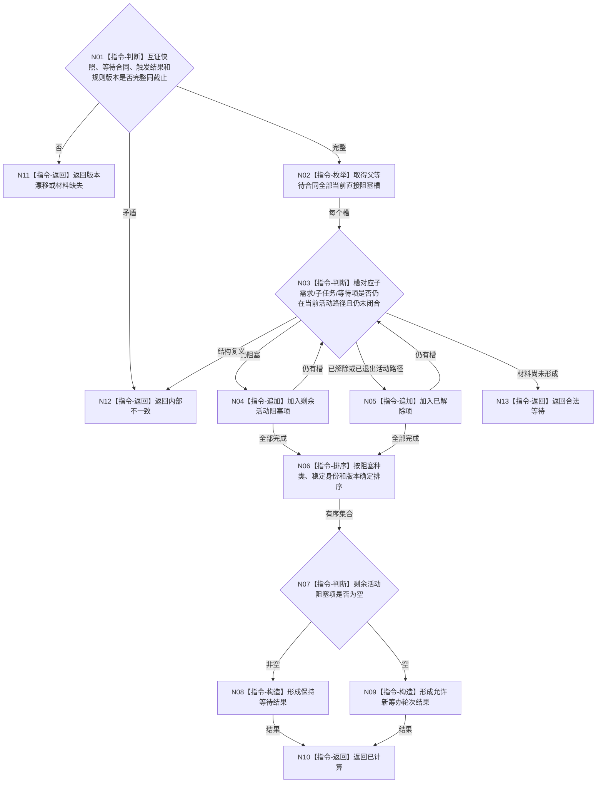

# BIZ-L3-004-12-02 计算父任务剩余活动阻塞项目标函数流程图 v0.1

更新时间：2026-08-03

## 依据

```text
3100、3200、5110、5220；BIZ-L2-004-12；复用L3-004-11-02互证快照
```

## 身份与边界

正式目标函数设计图。基于已互证的父任务、活动需求路径、等待合同和本次回流，纯值计算仍当前且仍阻塞的直接子项集合；不写任务或需求活动性。

## 函数合同

```text
根函数：计算父任务剩余活动阻塞项
归属模块 / 文件 / 层级：父任务等待重判算法 / 海中鱼巣/领域/算法.父任务等待重判.ixx / L3
现有或待新增：待新增；吸收鱼巣单项回流后立即重判节奏，排除整层批量等待
完整签名：父任务活动阻塞计算结果 计算父任务剩余活动阻塞项(const 父任务活动阻塞计算请求& 请求) noexcept
参数：请求为只读借用；含任务需求互证快照、父等待合同、单项回流触发结果、事实截止和阻塞计算规则版本
返回结果：值式结果；含已计算、合法等待、版本漂移或内部不一致，以及稳定排序的剩余阻塞项、已解除项、本轮仍等待原因和是否允许进入新筹办轮次
被调函数流程图：无；集合过滤、OR/AND路径判断和确定排序均为本函数内纯值指令
父图：BIZ-L2-004-12
```

## 流程图



## 节点合同

| 节点 | 类型 | 参数 / 输入绑定 | 结果 / 输出绑定 | 事实读写 | 后继条件 | 验证 |
| --- | --- | --- | --- | --- | --- | --- |
| N02—N05 | 指令 | 当前阻塞槽和活动路径 | 剩余/解除集合 | 无写入 | 全部槽处理 | 历史子项不继续阻塞；单项即时重判 |
| N06/N07 | 指令 | 两个集合 | 稳定结果 | 无写入 | 空或非空 | 排序不改变业务语义 |
| N08—N10 | 指令 | 剩余集合 | 保持等待或允许重筹办 | 无写入 | 完成 | 空集合不直接证明父目标完成 |

## 关键边界

OR/AND 活动路径由需求领域已发布事实提供，本函数不能自行改选路径。无剩余阻塞项只允许进入父任务自身目标比较或新筹办轮次，不能直接完成父任务。
