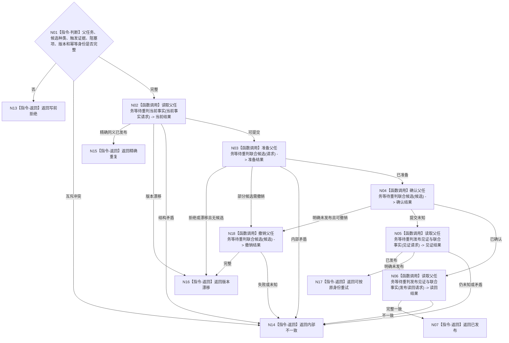

# BIZ-L3-004-12-03 发布父任务等待重判事务目标函数流程图 v0.1

更新时间：2026-08-03

## 依据

```text
4010—4050、3200、5210、5220；BIZ-L2-004-12
```

## 身份与边界

正式目标函数设计图。把保持等待、进入待重筹办或父任务目标已完成候选作为一个任务领域事务发布，并联合读回状态、等待合同和轮次；不写父需求满足。

## 函数合同

```text
根函数：任务业务服务::发布父任务等待重判事务
归属模块 / 文件 / 层级：任务领域服务 / 海中鱼巣/领域/服务.任务.ixx / L3
现有或待新增：待新增；复用任务生命周期提交并增加等待合同、阻塞集合和筹办轮次联合发布
完整签名：父任务等待重判发布结果 任务业务服务::发布父任务等待重判事务(const 父任务等待重判发布请求& 请求)
参数：请求为只读借用；含父任务、重判候选、触发证据、剩余阻塞项、预期任务/等待/轮次版本、幂等身份和预期事实代次
返回结果：调用方拥有的值式结果；含已发布、精确重复、写前拒绝、版本漂移、提交未知或内部不一致，以及任务状态、等待合同、筹办轮次、权威代次、发布见证和持久证据状态
被调函数流程图：BIZ-L4-004-12-03-01 读取父任务等待重判当前事实；BIZ-L4-004-12-03-02 准备父任务等待重判联合候选；BIZ-L4-004-12-03-03 确认父任务等待重判联合候选；BIZ-L4-004-12-03-04 撤销父任务等待重判联合候选；BIZ-L4-004-12-03-05 读取父任务等待重判发布见证与联合事实
父图：BIZ-L2-004-12
```

## 流程图



## 节点合同

| 节点 | 类型 | 参数 / 输入绑定 | 结果 / 输出绑定 | 事实读写 | 后继条件 | 验证 |
| --- | --- | --- | --- | --- | --- | --- |
| N01/N02 | 判断 / 调用 | 请求和当前任务 | 写前资格 | 只读任务事实 | 可提交、重复、漂移或错误 | 三类候选互斥，轮次单调 |
| N03/N04 | 函数调用 | 完整请求 | 不可见候选与确认 | 原子发布任务领域事实 | 已确认或非成功 | 状态、等待、阻塞集合和轮次同事务 |
| N05/N06 | 函数调用 | 原幂等身份和发布代次 | 发布见证与联合读回 | 只读已发布事实 | 完整或错误 | 提交未知不换键重试 |
| N07/N13—N17 | 返回 | 发布或非成功结果 | 结构化结果 | 分账持久证据 | 终止 | 不把发布成功解释成需求满足 |

## 关键边界

保持等待时不得伪写状态变化；进入待重筹办时轮次只增加一次；父任务完成必须携带父任务自身目标已达成证据。任何分支都不得写父需求满足或服务结算。
