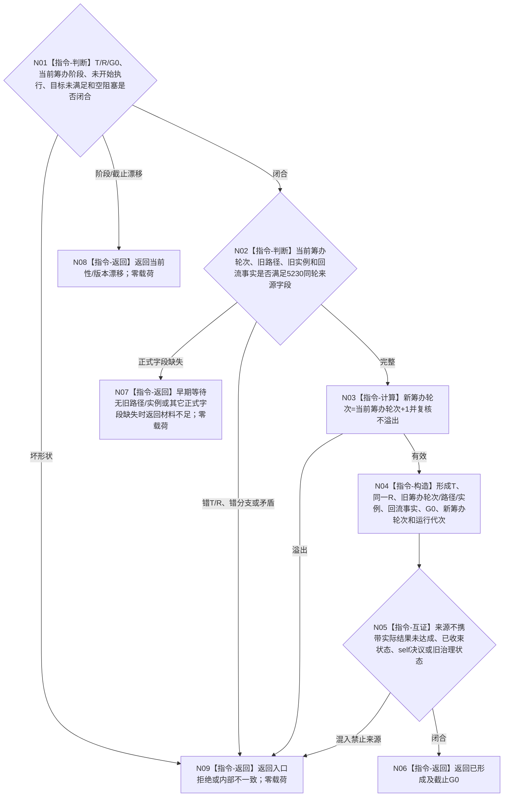

# BIZ-L3-004-12-03 形成同任务轮次后继筹办来源目标函数流程图 v0.2

更新时间：2026-08-27

## 依据与替代

```text
4260 v0.9、5210 v1.1、5220 v0.2、5230 v1.2
父图：BIZ-L2-004-12 v0.2
```

本图替代 v0.1“发布父任务等待重判事务”。v0.2只形成 5230 允许的强类型 `同任务轮次后继筹办来源` 值，不持久化、不迁移阶段、不发布路径/选择/实例/冻结。旧 BIZ-L4-004-12-03-01—05 自建候选事务全部退出。

## 函数合同

```text
根函数：任务等待回流重判组合器::形成同任务轮次后继筹办来源
归属模块 / 文件 / 目标分解深度：任务等待回流纯值算法 / 海中鱼巣/领域/内部治理/服务.任务等待回流重判.ixx / BIZ-L3
可见性：module-private；只由BIZ-L2-004-12 v0.2调用
现有或待新增：待新增纯值构造；实际发布复用BIZ-L2-004-03 v0.2/task owner唯一选择入口
完整签名：同任务轮次后继筹办来源形成结果 任务等待回流重判组合器::形成同任务轮次后继筹办来源(const 同任务轮次后继筹办来源形成请求& 请求) const noexcept
参数：完整任务材料、已绑定回流、目标未满足结果、空阻塞计算结果、G0、运行代次和来源规则版本
返回结果：已形成、材料不足、当前性/版本漂移、入口拒绝或内部不一致；已形成时只携带5230强类型来源和G0
被调函数流程图：无；纯值逐字段构造
```

## 流程图



## 关键边界

- 本函数不调用写入口。实际新路径、当前选择、实例和冻结只由 BIZ-L2-004-03 v0.2 经 task owner 唯一公开入口发布。
- 新筹办轮次仍属于同一未收束任务轮次；执行、结算、轮次已收束均不得形成本来源。
- 5210/5220允许早期等待而5230要求旧路径/实例的冲突尚未裁决时，必须返回材料不足，不能用空身份或旧任务虚拟存在补齐。
