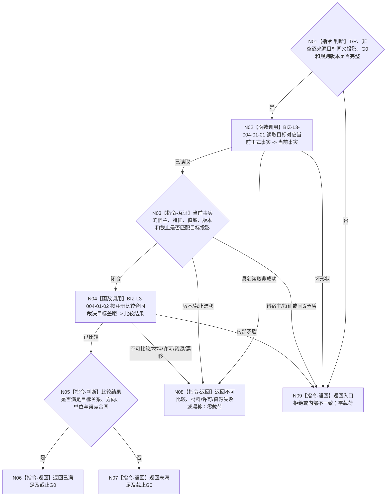

# BIZ-L3-004-12-04 比较受影响任务当前目标事实目标函数流程图 v0.2

更新时间：2026-08-27

## 依据与替代

```text
3200、4160、4260 v0.9、5090 v0.7、5210 v1.1、5220 v0.2
父图：BIZ-L2-004-12 v0.2
复用：BIZ-L3-004-01-01/02；输入目标来自BIZ-L2-004-11 v0.2逐T→D同义投影
```

本图替代 v0.1“比较父任务目标当前事实”。任务不保存冻结目标副本；当前任务目标只能由非空当前 `T→D` 所指具体需求目标逐项互证形成。

## 函数合同

```text
根函数：任务等待回流重判组合器::比较受影响任务当前目标事实
归属模块 / 文件 / 目标分解深度：任务等待回流只读组合 / 海中鱼巣/领域/内部治理/服务.任务等待回流重判.ixx / BIZ-L3
可见性：module-private；只由BIZ-L2-004-12 v0.2调用
现有或待新增：待新增适配；复用现有需求目标当前事实读取和注册比较合同
完整签名：受影响任务目标比较结果 任务等待回流重判组合器::比较受影响任务当前目标事实(const 受影响任务目标比较请求& 请求) const noexcept
参数：004-11完整任务材料中的逐来源同义目标投影、T/R、G0和比较规则版本；不接受任务目标副本、子结果值或上次比较结论
返回结果：已满足、未满足、不可比较、材料不足、当前性/版本漂移、入口/许可拒绝、资源失败或内部不一致；成功携带目标材料、当前事实、比较证据和G0
被调函数流程图：BIZ-L3-004-01-01 读取需求目标当前事实；BIZ-L3-004-01-02 按注册比较合同裁决目标差距
```

## 流程图



## 关键边界

- 子任务结束、调用返回、方法成功或某个来源需求的旧结论都不能替代当前正式事实。
- 一个状态变化可以自然使多个需求目标分别满足；本函数只比较当前受影响任务的同义目标投影，不分配任务结果，也不结算其它任务。
- 已满足只形成任务治理输入；需求自己的正式结算仍由需求在实际使用时 fresh 独立核算。
