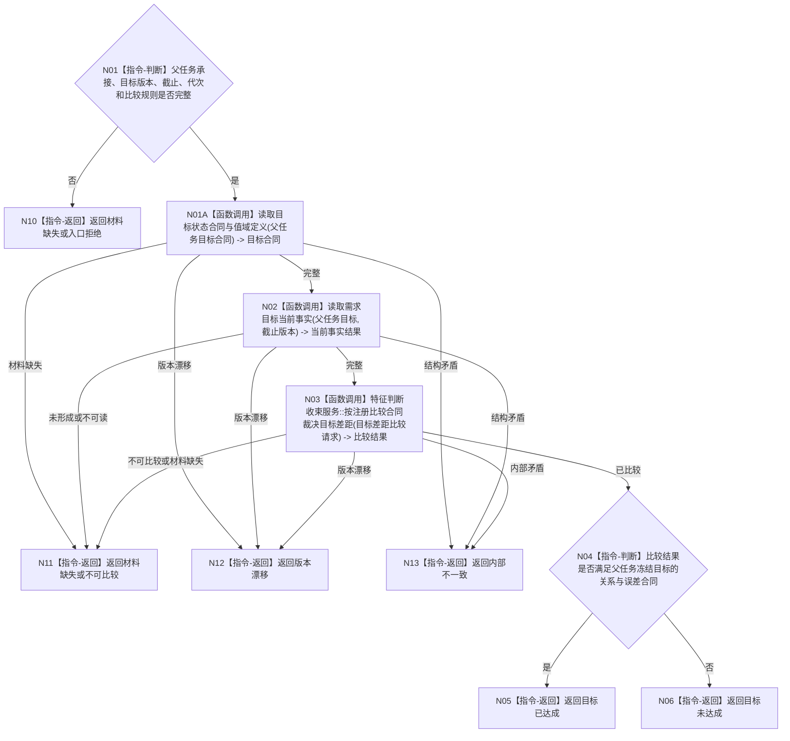

# BIZ-L3-004-12-04 比较父任务目标当前事实目标函数流程图 v0.1

更新时间：2026-08-03

## 依据

```text
3200、5090、5210、5220、4160；BIZ-L2-004-12；复用BIZ-L3-004-01-02
```

## 身份与边界

正式目标函数设计图。按父任务自身冻结目标读取当前正式事实并调用注册比较合同，裁决目标达成、未达成、不可比较或材料不足；子任务结果只作触发，不替代当前事实。

## 函数合同

```text
根函数：任务业务服务::比较父任务目标当前事实
归属模块 / 文件 / 层级：任务领域服务 / 海中鱼巣/领域/服务.任务.ixx / L3
现有或待新增：适配扩展；复用任务目标读取和特征判断收束服务
完整签名：父任务目标比较结果 任务业务服务::比较父任务目标当前事实(const 父任务目标比较请求& 请求) const
参数：请求为只读借用；含父任务完整承接、目标合同版本、事实截止、运行代次和比较规则版本
返回结果：调用方拥有的值式结果；含目标已达成、目标未达成、不可比较、材料缺失、版本漂移或内部不一致，以及目标事实、当前事实、注册比较结果、差距和来源版本
被调函数流程图：复用BIZ-L4-004-01-01-01读取目标状态合同与值域定义，复用BIZ-L3-004-01-01读取需求目标当前事实，复用BIZ-L3-004-01-02按注册比较合同裁决目标差距
父图：BIZ-L2-004-12
```

## 流程图



## 节点合同

| 节点 | 类型 | 参数 / 输入绑定 | 结果 / 输出绑定 | 事实读写 | 后继条件 | 验证 |
| --- | --- | --- | --- | --- | --- | --- |
| N01A/N02 | 函数调用 | 父任务冻结目标合同和截止版本 | 目标合同与当前正式事实 | 只读目标领域事实 | 完整或具名非成功 | 不读取子结果自报值代替当前事实 |
| N03 | 函数调用 | 目标事实和当前事实 | 注册比较结果 | 无写入 | 已比较或非成功 | 按值域、单位、方向、误差和版本调度 |
| N04—N06 | 指令 | 比较结果和目标合同 | 达成或未达成 | 无写入 | 完成 | 不用所有类型统一减法 |

## 关键边界

子任务完成、子需求满足、方法返回成功和回执到达都不能直接证明父目标达成。父任务必须按自身目标对应的当前正式事实独立比较。
