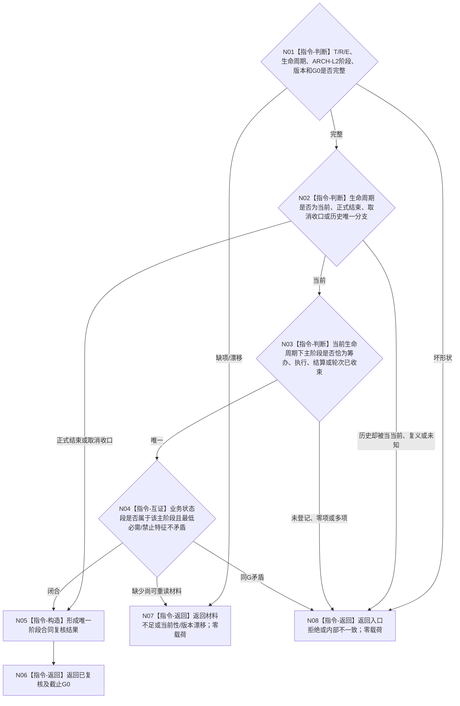

# BIZ-L3-004-13-01 复核任务当前主阶段合同目标函数流程图 v0.2

更新时间：2026-08-27

## 依据与替代

```text
3200、4260 v0.9、5090 v0.7、5210 v1.1、5230 v1.2
父图：BIZ-L2-004-13 v0.2
```

本图替代 v0.1“复核任务阶段合同”。v0.1把任务生命周期、父等待、轮次和冻结压成六类阶段；v0.2只复核正式生命周期与 ARCH-L2 当前主阶段 / 业务状态段的分账，不从材料是否存在反推阶段。

## 函数合同

```text
根函数：任务主阶段治理组合器::复核任务当前主阶段合同
归属模块 / 文件 / 目标分解深度：任务主阶段纯值算法 / 海中鱼巣/领域/内部治理/服务.任务主阶段治理.ixx / BIZ-L3
可见性：module-private；只由BIZ-L2-004-13 v0.2调用
现有或待新增：待新增纯值算法
完整签名：任务阶段合同复核结果 任务主阶段治理组合器::复核任务当前主阶段合同(const 任务阶段合同复核请求& 请求) const noexcept
参数：004-11完整任务材料中的生命周期、T/R、正式E、ARCH-L2当前主阶段/业务状态段、阶段版本和G0；不接收旧任务治理状态或队列状态
返回结果：已复核、材料不足、当前性/版本漂移、入口拒绝或内部不一致；成功携带唯一生命周期分支、主阶段、业务状态段、T/R/E和G0
被调函数流程图：无；只对已读回材料做纯值矩阵复核
```

## 流程图



## 关键边界

- 目标已达成 / 未达成、业务失败和取消结论不是主阶段；待重筹办也不是当前主阶段。
- 生命周期不表达筹办中、执行中、结算中或已完成业务状态。
- 阶段来自正式状态读取；选择、冻结、等待事实只能验证阶段材料，不能反向猜阶段。
