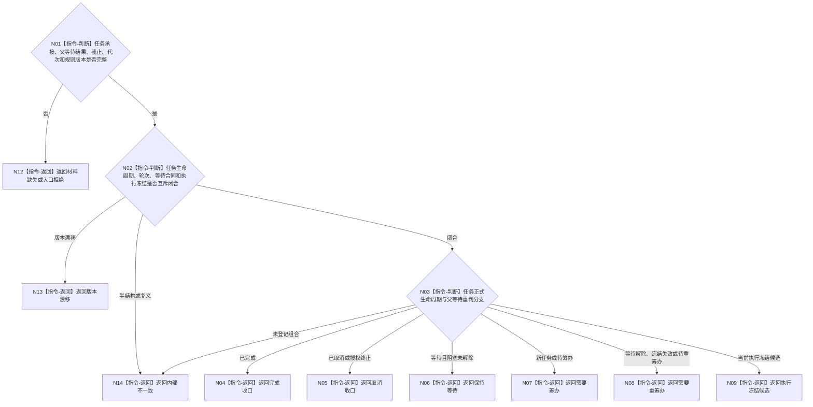

# BIZ-L3-004-13-01 复核任务阶段合同目标函数流程图 v0.1

更新时间：2026-08-03

## 依据

```text
3200、5090、5210—5230；BIZ-L2-004-13
```

## 身份与边界

正式目标函数设计图。纯值复核任务完整承接、父等待重判结果、任务轮次和当前生命周期是否唯一落入收口、等待、待筹办、待重筹办或执行冻结候选之一；不迁移任务状态。

## 函数合同

```text
根函数：复核任务阶段合同
归属模块 / 文件 / 层级：任务阶段裁决算法 / 海中鱼巣/领域/算法.任务阶段裁决.ixx / L3
现有或待新增：待新增；复用任务状态和父等待值式快照
完整签名：任务阶段合同复核结果 复核任务阶段合同(const 任务阶段合同复核请求& 请求) noexcept
参数：请求为只读借用；含任务完整承接、父等待重判结果、事实截止、运行代次和阶段规则版本
返回结果：值式结果；含完成收口、取消收口、保持等待、需要筹办、需要重筹办、执行冻结候选、材料缺失、版本漂移或内部不一致，以及任务轮次、状态版本、等待/冻结引用和裁决证据
被调函数流程图：无；状态、轮次、等待和冻结互斥矩阵为本函数内纯值指令
父图：BIZ-L2-004-13
```

## 流程图



## 节点合同

| 节点 | 类型 | 参数 / 输入绑定 | 结果 / 输出绑定 | 事实读写 | 后继条件 | 验证 |
| --- | --- | --- | --- | --- | --- | --- |
| N01/N02 | 指令 | 任务和父等待材料 | 唯一阶段资格 | 无写入 | 闭合、漂移或错误 | 状态、轮次、等待和冻结矩阵 |
| N03—N09 | 指令 | 唯一阶段材料 | 六类互斥阶段结果 | 无写入 | 恰一返回 | 工作线程不参与工作种类裁决 |

## 关键边界

父等待解除不等于任务完成，只能进入目标比较后的重筹办或收口分支。队列状态、线程空闲和任务优先级不参与正式阶段合同。

