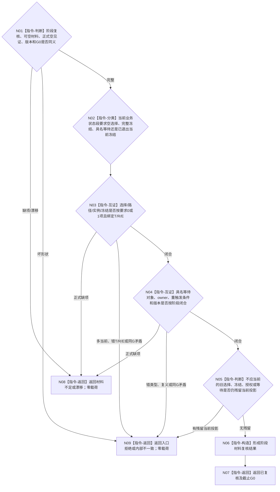

# BIZ-L3-004-13-02 复核主阶段所需选择冻结与等待材料目标函数流程图 v0.2

更新时间：2026-08-27

## 依据与替代

```text
3200、4260 v0.9、5210 v1.1、5230 v1.2
父图：BIZ-L2-004-13 v0.2
输入来源：BIZ-L2-004-11 v0.2 已读回阶段材料
```

本图替代 v0.1“复核当前执行冻结”。v0.1再次调用读取叶并在阶段裁决中读取动作入口、技术许可和授权需求；v0.2只复核 `004-11` 已经同 `G0` 读回的可空选择 / 实例 / 冻结 / 等待材料，不产生第二读取组合。

## 函数合同

```text
根函数：任务主阶段治理组合器::复核主阶段所需选择冻结与等待材料
归属模块 / 文件 / 目标分解深度：任务主阶段纯值算法 / 海中鱼巣/领域/内部治理/服务.任务主阶段治理.ixx / BIZ-L3
可见性：module-private；只由BIZ-L2-004-13 v0.2调用
现有或待新增：待新增纯值算法；复用004-11快照，不新增读取provider
完整签名：任务阶段材料复核结果 任务主阶段治理组合器::复核主阶段所需选择冻结与等待材料(const 任务阶段材料复核请求& 请求) const noexcept
参数：004-13-01阶段复核、004-11可空选择/路径/实例/冻结/等待事实与正式空见证、G0和材料规则版本
返回结果：已复核、材料不足、当前性/版本漂移、入口拒绝或内部不一致；成功携带阶段要求的规范材料形状和G0
被调函数流程图：无；纯值逐字段互证
```

## 流程图



## 关键边界

- 本函数零事实读取、零写入；旧 `BIZ-L4-004-13-02-01 v0.1` 退出当前调用树。
- 待初次筹办的正式空选择是完整材料；执行冻结完成阶段缺少冻结是材料不足；同G存在两份当前选择是内部不一致。
- 技术许可、安全硬否决、控制态和调度资格在真实派发 / 动作前各自 fresh 读取，不进入阶段材料复核。
