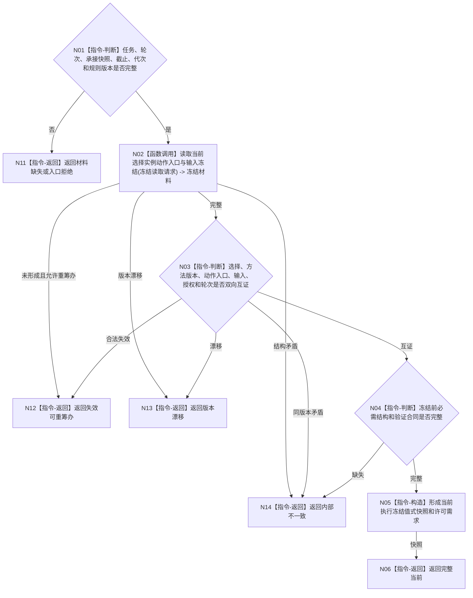

# BIZ-L3-004-13-02 复核当前执行冻结目标函数流程图 v0.1

更新时间：2026-08-03

## 依据

```text
5090、5210、5230、5300、8100；BIZ-L2-004-13
```

## 身份与边界

正式目标函数设计图。在调度阶段复核任务当前选择、实例方法、动作入口、输入冻结、授权和轮次仍相互闭合；只决定是否存在可进入权限复核的冻结候选，不执行动作。

## 函数合同

```text
根函数：任务业务服务::复核当前执行冻结
归属模块 / 文件 / 层级：任务领域服务 / 海中鱼巣/领域/服务.任务.ixx / L3
现有或待新增：适配扩展；复用现行任务选择、实例方法和执行冻结读取
完整签名：当前执行冻结复核结果 任务业务服务::复核当前执行冻结(const 当前执行冻结复核请求& 请求) const
参数：请求为只读借用；含任务、期望轮次、任务完整承接、事实截止、运行代次和冻结规则版本
返回结果：调用方拥有的值式结果；含完整当前、失效可重筹办、材料缺失、版本漂移或内部不一致，以及当前选择、实例方法、动作入口、输入冻结、授权、许可需求和全部来源版本
被调函数流程图：BIZ-L4-004-13-02-01 读取当前选择实例动作入口与输入冻结
父图：BIZ-L2-004-13
```

## 流程图



## 节点合同

| 节点 | 类型 | 参数 / 输入绑定 | 结果 / 输出绑定 | 事实读写 | 后继条件 | 验证 |
| --- | --- | --- | --- | --- | --- | --- |
| N02 | 函数调用 | 任务、轮次和截止 | 冻结材料 | 只读任务/方法事实 | 完整或具名非成功 | 不按方法名或函数地址补齐 |
| N03/N04 | 指令 | 冻结材料 | 当前性与结构资格 | 无写入 | 当前、失效、漂移或错误 | 冻结前结构缺口为内部错误 |
| N05/N06 | 指令 | 完整冻结 | 值式快照 | 无写入 | 完成 | 尚未发放许可、派发或执行 |

## 关键边界

本函数发生在调度裁决阶段，不替代动作开始前的 `BIZ-L3-004-07-02`。前者确认可形成执行工作包，后者在实际动作前重新读取输入场景、许可和禁止项。
