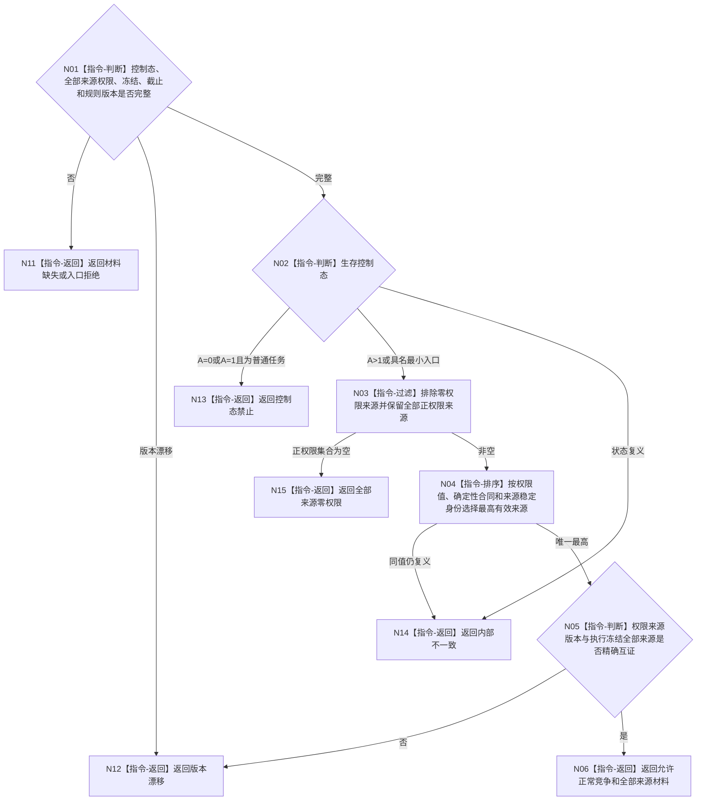

# BIZ-L3-004-13-03 复核生存控制与任务权限目标函数流程图 v0.1

更新时间：2026-08-03

## 依据

```text
6150、6170、8100、8200；BIZ-L2-004-13
```

## 身份与边界

正式目标函数设计图。纯值复核生存控制态、任务全部来源权限和冻结版本，决定任务是否能参加正常执行竞争；不计算安全值、服务值或权限，也不分配线程资源。

## 函数合同

```text
根函数：复核生存控制与任务权限
归属模块 / 文件 / 层级：任务阶段裁决算法 / 海中鱼巣/领域/算法.任务阶段裁决.ixx / L3
现有或待新增：待新增；复用6150/6170已发布权限投影
完整签名：生存控制任务权限复核结果 复核生存控制与任务权限(const 生存控制任务权限复核请求& 请求) noexcept
参数：请求为只读借用；含生存控制态、任务全部目标等价来源权限、当前执行冻结、事实截止和权限规则版本
返回结果：值式结果；含允许正常竞争、控制态禁止、全部来源零权限、材料缺失、版本漂移或内部不一致，以及最高有效来源权限、全部来源权限材料和确定性比较见证
被调函数流程图：无；控制态门、零权限过滤和最高有效权限选择均为本函数内纯值指令
父图：BIZ-L2-004-13
```

## 流程图



## 节点合同

| 节点 | 类型 | 参数 / 输入绑定 | 结果 / 输出绑定 | 事实读写 | 后继条件 | 验证 |
| --- | --- | --- | --- | --- | --- | --- |
| N02 | 指令 | 生存控制态和任务种类 | 控制门结论 | 无写入 | 禁止或继续 | A=0/1普通任务不竞争 |
| N03/N04 | 指令 | 全部来源权限 | 最高有效来源与全集 | 无写入 | 零或正 | 零权限排除但材料不丢；同值确定性 |
| N05/N06 | 指令 | 权限和冻结版本 | 正常竞争资格 | 无写入 | 互证完成 | 权限正值不等于资源配额或已派发 |

## 关键边界

任务管理只消费权限投影。任务积压、线程数量、工作耗时和队列长度不得反向修改安全值、服务值、控制态或权限来源。

