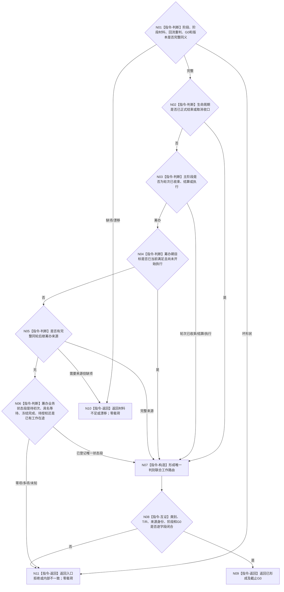

# BIZ-L3-004-13-03 形成任务下一工作路由目标函数流程图 v0.2

更新时间：2026-08-27

## 依据与替代

```text
3200、4260 v0.9、5090 v0.7、5210 v1.1、5230 v1.2、8100 v0.7
父图：BIZ-L2-004-13 v0.2
```

本图替代 v0.1“复核生存控制与任务权限”。控制态与调度资格属于冻结后普通派发选择，不属于任务业务阶段。本函数只把已复核阶段、阶段材料和 `004-12 v0.2` 重判结果映射为唯一 T03 工作路由。

## 函数合同

```text
根函数：任务主阶段治理组合器::形成任务下一工作路由
归属模块 / 文件 / 目标分解深度：任务主阶段纯值算法 / 海中鱼巣/领域/内部治理/服务.任务主阶段治理.ixx / BIZ-L3
可见性：module-private；只由BIZ-L2-004-13 v0.2调用
现有或待新增：待新增纯值算法
完整签名：任务下一工作路由形成结果 任务主阶段治理组合器::形成任务下一工作路由(const 任务下一工作路由形成请求& 请求) const noexcept
参数：004-13-01/02复核结果、004-12 v0.2重判结果、运行代次、G0和路由规则版本
返回结果：已形成、材料不足、当前性/版本漂移、入口拒绝或内部不一致；已形成携带且只携带一种下一工作类别及其强类型来源
被调函数流程图：无；纯值判别联合映射
```

## 流程图



## 关键边界

- 目标当前已满足的优先级只适用于尚未执行的筹办阶段；执行 / 结算阶段的当前满足不能撤销已经发生的动作。
- 同轮后继筹办必须携带 `004-12 v0.2` 已形成的 5230 强类型来源；不存在“待重筹办”状态或下一筹办裸整数。
- 冻结完成只返回“待普通派发”，由 `003-03 v0.4` 决定0..1项；本函数不读取A/L/H、倍率、控制态或队列资源。
