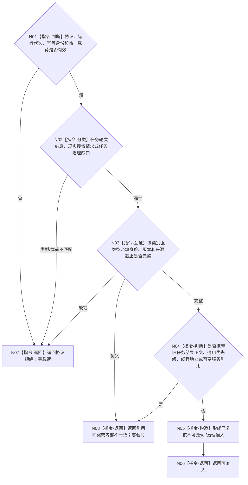

# BIZ-L3-004-14-01 复核一个任务管理到self具名输入目标函数流程图 v0.2

更新时间：2026-08-27

## 依据与替代

```text
0050、3200 v1.0、5090 v0.7、6340、8100 v0.7、8200 v0.7
BIZ-L2-004-14 v0.2
```

本图完整替代 v0.1“复核任务管理上行消息”。本函数不复核通用任务结果、等待、许可、派生需求或事实变化编码，只接受 T03 当前三个具名强类型输出。

## 函数合同

```text
根函数：任务管理上行输入复核器::复核一个任务管理到self具名输入
归属模块 / 文件 / 目标分解深度：任务管理上行强类型协议 / 海中鱼巣/线程/协议.任务管理到self输入.ixx / BIZ-L3
可见性：模块公开纯值函数；不访问邮箱或领域服务
现有或待新增：待新增/迁移旧自我治理消息协议的T03生产分支
完整签名：任务管理到self输入复核结果 任务管理上行输入复核器::复核一个任务管理到self具名输入(const 任务管理到self输入复核请求& 请求) noexcept
参数：任务轮次结算定位、自我现实执行授权请求或任务治理缺口定位恰一，以及运行代次和输入幂等身份
返回结果：可准入、协议拒绝、引用冲突或内部不一致；成功携带规范类型、不可变载荷、来源截止和幂等键投影
被调函数流程图：无；类型—载荷和逐字段绑定均为纯值指令
```

## 流程图



## 类别边界

| 类别 | 必须保存 | 禁止保存 |
| --- | --- | --- |
| 任务轮次结算定位 | T、R、轮次结算身份、G | 实际结果正文、当前实例、执行轮次猜测 |
| 自我现实执行授权请求 | 任务/三轮次/冻结/实例/现实动作范围/G/规则及请求身份 | 调度资格、技术许可、旧授权正文 |
| 任务治理缺口定位 | 具名缺口身份、来源范围、证据G和合法生产者/后继 | 原始报告、日志文本、空泛“需要学习” |
