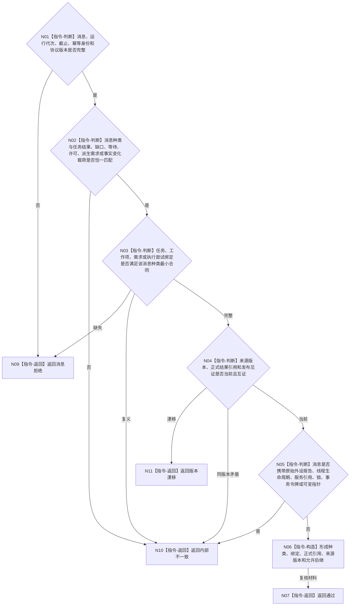

# BIZ-L3-004-14-01 复核任务管理上行消息目标函数流程图 v0.1

更新时间：2026-08-03

## 依据

```text
4050、5090、8100、8110、8200；BIZ-L2-004-14
```

## 身份与边界

正式目标函数设计图。纯值复核任务管理上行消息的业务种类、对象绑定、来源版本、发布见证和非权威边界；不访问邮箱或领域服务。

## 函数合同

```text
根函数：复核任务管理上行消息
归属模块 / 文件 / 层级：任务管理上行消息协议 / 海中鱼巣/线程/协议.任务管理上行消息.ixx / L3
现有或待新增：适配扩展；复用现行强类型执行回执转治理消息协议并覆盖通用任务结果、缺口、等待、许可和派生需求材料
完整签名：任务管理上行消息复核结果 复核任务管理上行消息(const 任务管理上行消息复核请求& 请求) noexcept
参数：请求为只读借用；含不可变治理消息、来源任务/工作项/需求版本、运行代次、事实截止、消息幂等身份和协议版本
返回结果：值式结果；含通过、消息拒绝、版本漂移或内部不一致，以及消息种类、业务对象绑定、正式结论引用、来源版本和允许后继
被调函数流程图：无；种类—载荷互斥矩阵和字段复核均为本函数内纯值指令
父图：BIZ-L2-004-14
```

## 流程图



## 节点合同

| 节点 | 类型 | 参数 / 输入绑定 | 结果 / 输出绑定 | 事实读写 | 后继条件 | 验证 |
| --- | --- | --- | --- | --- | --- | --- |
| N01—N03 | 指令 | 消息和绑定 | 协议资格 | 无写入 | 完整、拒绝或错误 | 种类载荷恰一，具体业务对象绑定 |
| N04 | 指令 | 来源版本和正式引用 | 当前性 | 无写入 | 当前、漂移或错误 | 消息不自证业务结论 |
| N05—N07 | 指令 | 载荷边界 | 值式复核材料 | 无写入 | 通过或错误 | 排除外设原始报告和线程生命周期 |

## 关键边界

纯线程生命周期消息只能进入控制面板线程信息链。任务管理上行消息只携带正式结论引用和后继材料，不能把消息本身升级为任务、需求或世界事实。

