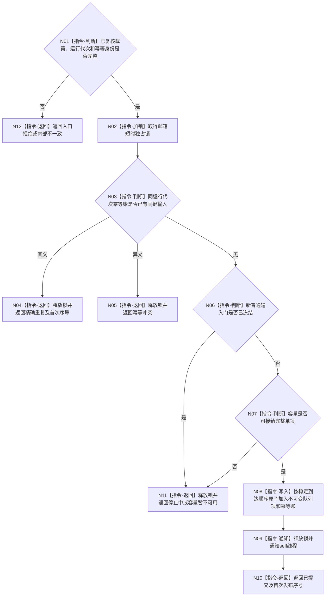

# BIZ-L3-004-14-02 原子提交一个已复核self治理输入目标函数流程图 v0.2

更新时间：2026-08-27

## 依据与替代

```text
0050、8100 v0.7、8200 v0.7
BIZ-L2-004-14 v0.2、BIZ-L3-004-14-01 v0.2、BIZ-L2-002-01 v0.2
```

本图完整替代 v0.1“提交不可变自我治理消息”。旧图按调用方优先级插入队列并依赖桥内待重发；v0.2只在短锁内完成幂等、停止、容量和单项原子入队。普通业务输入保持稳定到达顺序，停止由专属来源和冻结批次规则处理。

## 函数合同

```text
根函数：有界自我治理邮箱::原子提交一个已复核治理输入
归属模块 / 文件 / 目标分解深度：有界自我治理邮箱 / 海中鱼巣/线程/有界自我治理队列.ixx / BIZ-L3
现有或待新增：适配现有邮箱；退出任务管理业务输入自定义优先级和桥内重发状态
完整签名：自我治理输入提交结果 有界自我治理邮箱::原子提交一个已复核治理输入(const 自我治理输入提交请求& 请求) noexcept
参数：已复核不可变输入、运行代次和输入幂等身份
返回结果：已提交、精确重复、容量暂不可用、停止中、幂等冲突或内部不一致，以及首次发布序号；只有已提交/重复序号非零
被调函数流程图：无；短锁内纯队列事务
```

## 流程图



## 关键边界

- 幂等账查询先于停止门，已提交同义请求可在停发后收敛；新请求不可越过停发。
- 锁内不调用领域服务、不解释任务事实、不生成优先级、不保存第二份待重发材料。
- 容量暂不可用时由 T03 原处理槽保留同一请求；邮箱不返回可变候选令牌。
