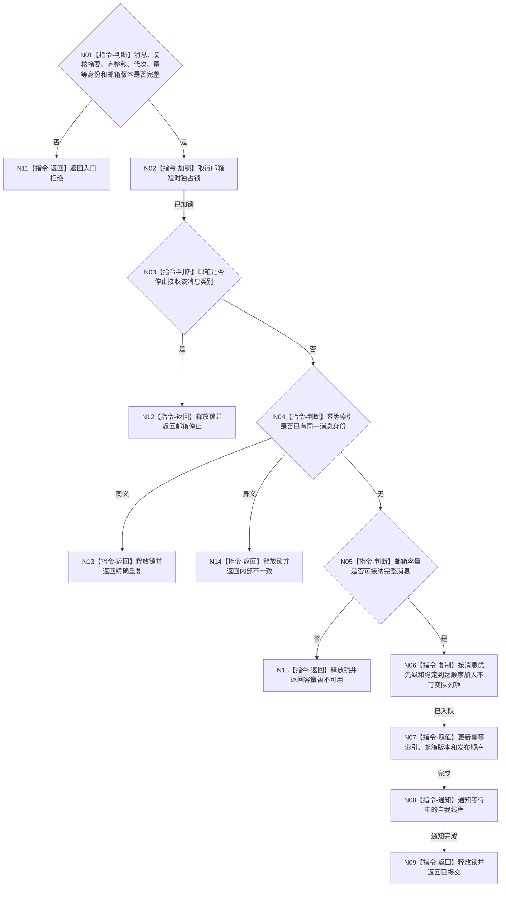

# BIZ-L3-004-14-02 提交不可变自我治理消息目标函数流程图 v0.1

更新时间：2026-08-03

## 依据

```text
4050、8100、8200；BIZ-L2-004-14；BIZ-L3-002-01-01为消费方
```

## 身份与边界

正式目标函数设计图。把一条已经通过协议复核的不可变治理消息按幂等身份加入有界自我治理邮箱；锁内只判重、检查容量和入队，不调用领域服务。

## 函数合同

```text
根函数：有界自我治理邮箱::提交不可变治理消息
归属模块 / 文件 / 层级：有界自我治理邮箱 / 海中鱼巣/线程/有界自我治理队列.ixx / L3
现有或待新增：适配扩展；复用现行邮箱队列、优先级和停止唤醒能力
完整签名：自我治理邮箱提交结果 有界自我治理邮箱::提交不可变治理消息(const 自我治理邮箱提交请求& 请求)
参数：请求为只读借用；含不可变治理消息、协议复核摘要、当前完整秒、运行代次、消息幂等身份和期望邮箱版本
返回结果：调用方拥有的值式结果；含已提交、精确重复、容量暂不可用、邮箱停止、版本漂移或内部不一致，以及消息身份、邮箱发布顺序、邮箱版本和重试边界
被调函数流程图：无；锁内判重、容量、排序入队和通知均为本函数内指令
父图：BIZ-L2-004-14
```

## 流程图



## 节点合同

| 节点 | 类型 | 参数 / 输入绑定 | 结果 / 输出绑定 | 事实读写 | 后继条件 | 验证 |
| --- | --- | --- | --- | --- | --- | --- |
| N02—N05 | 指令 | 请求和邮箱状态 | 提交资格 | 只读/锁内邮箱元数据 | 可写或具名非成功 | 停止、版本、幂等和容量 |
| N06—N08 | 指令 | 不可变消息 | 队列项和发布顺序 | 只写消息队列 | 已入队 | 不调用领域服务；优先级同值稳定 |
| N09/N11—N15 | 指令-返回 | 邮箱结果 | 结构化状态 | 无业务事实写入 | 终止 | 满载保留原消息供桥重试 |

## 关键边界

邮箱发布不等于自我消费；自我线程只在下一冻结批次中处理消息。容量暂不可用时调用方只能重试逐字段相同的消息，不能重做任务提交或独立回读。
