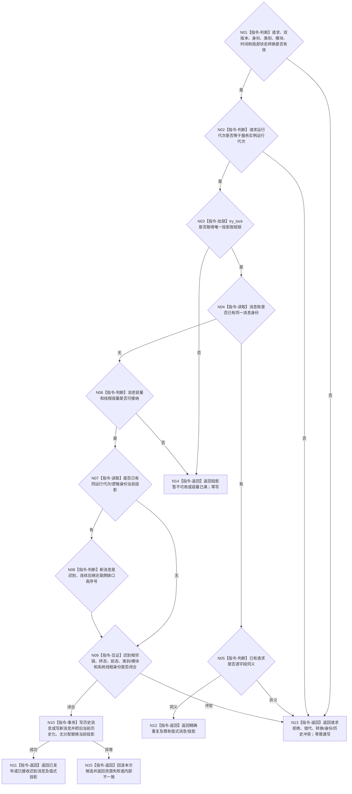

# BIZ-L3-004-15-01 发布线程生命周期消息并更新当前投影目标函数流程图 v0.2

更新时间：2026-08-27

## 依据与替代

```text
4050、8110 v0.3
THREAD-LIFECYCLE-PROJECTION-SERVICE 详细设计 v0.1
BIZ-L2-004-15 v0.2
```

本图完整替代 v0.1“构造线程生命周期故障消息”，并复用已发布的唯一通用 provider。发布请求由具体线程按真实物理事件形成；provider 只校验和写消息账 / 当前投影，不替具体线程决定事件。旧 `BIZ-L3-004-15-02`“线程生命周期消息队列”不再属于当前004-15子树。

## 函数合同

```text
根函数：线程生命周期投影服务::发布
归属模块 / 文件 / 目标分解深度：海中鱼巣.线程.投影.线程生命周期 / 海中鱼巣/线程/投影.线程生命周期.ixx / BIZ-L3
可见性：公开发布端口实现；具体线程只持窄发布端口
现有或待新增：当前复用；已发布代码和provider专项已闭合公开合同，具体T04调用尚未接线
完整签名：线程生命周期发布结果 线程生命周期投影服务::发布(const 线程生命周期发布请求& 请求) noexcept override
参数：完整不可变线程生命周期发布请求
返回结果：已发布、精确重复、已接收迟到消息、请求拒绝、消息身份冲突、前一投影不一致、终态回退、系统线程身份冲突、非法状态转换、历史链冲突、运行代次不匹配、投影暂不可用、容量已满、资源失败或内部不一致，以及合同允许的消息和当前投影副本
被调函数流程图：无；锁外校验和单锁消息账 / 当前投影事务均为本函数内指令
```

## 流程图



## 事务与非职责

- 消息稳定身份为 `{运行代次, 线程逻辑身份, 事件序号}`；同身份同请求精确重复，同身份异义冲突。
- 更低序号只能进入历史；更高序号不得越过已确认终态，迟到消息不得覆盖当前投影。
- provider 非阻塞。锁竞争、容量和资源失败不让调用线程等待，也不改变线程真实物理状态。
- 本函数不写任务、需求、世界、动作、因果或价值事实，不调用日志、控制面板或业务服务。
